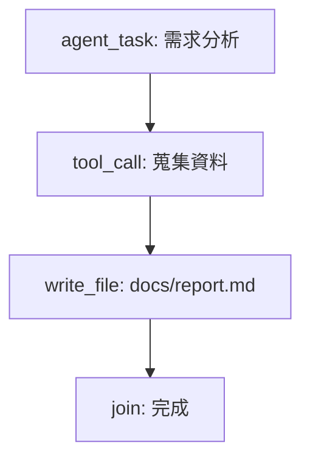

# Graph Debug 手動驗收與排查指南（TaskGraph v3）

## 1) 驗收目標

確認 Graph UI 與 v3 run bundle 一致：

1. 能渲染 `graph_mermaid`。
2. node list / node drawer / SVG node 狀態一致。
3. `run.update` / `node.update` 事件可更新 UI。

## 2) 標準檢查步驟

1. 開啟 `#/graph` 並選擇一個 run。
2. 確認 graph API payload 含 `run_id`、`nodes`、`graph_mermaid`、`node_states`。
3. 驗證 Mermaid 成功渲染為 SVG。
4. 點擊 node list 任一節點，drawer 顯示 `type/status/inputs/outputs/events`。
5. 點擊 SVG 對應節點，drawer 應切換到同一 node。
6. 觸發 SSE 更新後，list 與 SVG `node-status--*` class 應同步。

## 3) 常見失敗排查

### A. `graph_mermaid` 缺失

- 現象：無圖、僅顯示空態。
- 檢查：後端 run bundle 是否真的帶 `graph_mermaid`。
- 處理：修正資料來源，不做 legacy graph fallback。

### B. Mermaid 載入失敗

- 現象：`window.__mermaid` 不存在或 `render` 失敗。
- 檢查：Console + Network；優先確認本地 vendor 載入。
- 處理：修正前端資源/版本，不引入 CDN-only 依賴。

### C. SVG 有圖但 node 互動失效

- 現象：點 SVG 沒反應。
- 檢查：selector 與事件綁定是否對應目前 Mermaid DOM。
- 處理：讓 SVG node click 與 list click 共用同一選點邏輯。

## 4) Mermaid（v3）最小範例

## 5) 文件分層

- 正式執行模型：本文件 + README + SPEC。
- 匯入/轉換工具：`docs/migration_v3.md`。
- 歷史背景：`docs/refactor/*`。
