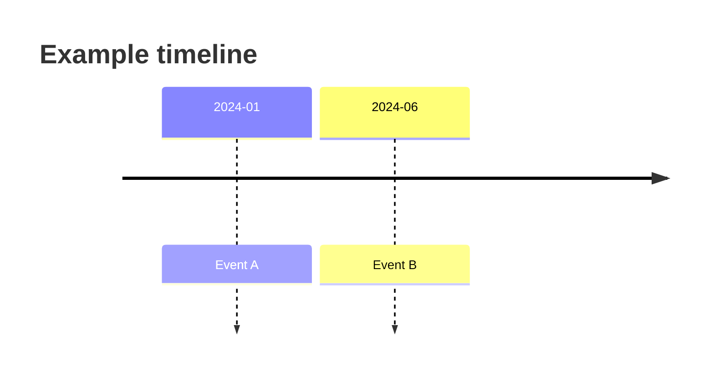

# Diagram selection

Choose the simplest Mermaid diagram that genuinely clarifies the information. If a diagram does not reduce confusion, do not use one.

## When to use which diagram

### `timeline`
- Use for:
  - 事件始末
  - 法規頒布、修訂、生效時間
  - 產品/政策/技術演進
- Best when the reader needs chronological order first.

### `flowchart`
- Use for:
  - 因果鏈
  - 決策流程
  - 制度或機制如何運作
- Best when the reader needs to understand "because A leads to B".

### `sequenceDiagram`
- Use for:
  - 多角色互動
  - 申報/審查/交易/資料流轉順序
  - 溝通或協作過程
- Best when the order of exchanges between actors matters.

### `mindmap`
- Use for:
  - 概念分類
  - 主題樹
  - 大類到細項的拆解
- Best when the reader needs a taxonomy rather than a timeline.

## Selection heuristics

- If the core question is "先後發生什麼": choose `timeline`.
- If the core question is "為什麼會這樣": choose `flowchart`.
- If the core question is "誰和誰怎麼互動": choose `sequenceDiagram`.
- If the core question is "有哪些類別與子概念": choose `mindmap`.

## Syntax guardrails

- Use official Mermaid syntax only.
- Keep node labels short; move long explanations to normal prose below the diagram.
- Quote labels when they contain punctuation or risk parser confusion.
- In `flowchart` and `sequenceDiagram`, avoid bare lowercase `end`; quote it or rewrite it.
- Unknown words or misspellings can break Mermaid diagrams, so keep the code minimal and deterministic.
- If the renderer support is uncertain for a newer diagram type, fall back to `flowchart` or plain prose.

## Source annotation rule

Every Mermaid block must be followed by a plain-text source note, for example:

````md

來源註記：來源 A；來源 B
````

If a diagram synthesizes multiple sources, include the key sources that shaped the structure instead of trying to cite every sentence in the node text.
