# Mermaid 圖表製作 Skill

## 核心原則

1. **先選對圖表類型**，再套用中文兼容規則
2. **中文節點標籤**在大多數圖表均可用，但有若干語法陷阱
3. **渲染環境決定字型**，skill 本身只控制語法正確性
4. **優先使用 Artifacts（React/HTML）**渲染 Mermaid，比 Markdown code block 更可靠

***

## 圖表類型速查

| 需求 | 使用類型 | 中文支援 |
|------|---------|---------|
| 程序/流程 | flowchart | 完整支援 |
| 系統互動/API | sequenceDiagram | 完整支援 |
| 物件導向 | classDiagram | 方法名建議英文 |
| 狀態機 | stateDiagram-v2 | 完整支援 |
| 資料庫設計 | erDiagram | 欄位名需英文 |
| 時程規劃 | gantt | 完整支援 |
| 比例分配 | pie | 完整支援 |
| 概念發散 | mindmap | 完整支援 |
| 時間事件 | timeline | 完整支援 |
| 矩陣分析 | quadrantChart | 完整支援，點名稱含特殊符號需加引號 |
| 系統架構（新版） | architecture-beta | 僅 v11+，標籤支援中文，ID 必須英文 |
| 看板/Sprint 管理 | kanban | 僅 v11.4+，標籤支援中文，ID 必須英文 |
| Git 歷史 | gitgraph | branch 名建議英文 |

***

## 中文兼容規則（必讀）

### 規則 1：含特殊字元的中文節點必須加引號

節點文字含有 ()[]{}:, 等符號時，必須用雙引號包裹整個標籤：

```
# 錯誤
A[用戶(User)] --> B

# 正確
A["用戶(User)"] --> B

# 錯誤
A[前端: React] --> B

# 正確
A["前端: React"] --> B
```

### 規則 2：erDiagram 欄位名只能用英文

```
# 正確
erDiagram
    用戶 {
        int id PK "主鍵"
        string name "姓名"
        string email "電子郵件"
    }

# 錯誤 - 欄位名不能用中文
erDiagram
    用戶 {
        int 編號 PK
    }
```

### 規則 3：classDiagram 避免純中文方法名

class 的方法名（method）建議用英文，屬性類型也用英文，class 名稱可用中文：

```
# 推薦（屬性名英文，class 名中文）
classDiagram
    class 用戶 {
        +String name
        +int age
        +login() bool
    }

# 可能有解析問題（避免中文方法名）
classDiagram
    class 用戶 {
        +登入() bool
    }
```

### 規則 4：sequenceDiagram participant 含空格加 as 別名

```
# 有空格時用 as 別名
sequenceDiagram
    participant FE as 前端系統
    participant BE as 後端 API
    FE->>BE: 發送請求

# 無空格時可直接用中文
sequenceDiagram
    participant 前端
    participant 後端
    前端->>後端: 呼叫API
```

### 規則 5：gitgraph branch 名稱用英文

```
# 正確：commit 訊息可用中文，branch 名用英文
gitgraph
    commit id: "初始化專案"
    branch feature/login
    commit id: "新增登入功能"
    checkout main
    merge feature/login id: "合併登入功能"

# 不建議：中文 branch 名
gitgraph
    branch 登入功能分支
```

### 規則 6：flowchart 連結文字無限制

邊（edge）上的文字完整支援中文，無需引號：

```
flowchart TD
    A -->|成功| B
    A -->|失敗| C
    A -- 驗證中 --> D
```

### 規則 7：gantt 完整支援中文

```
gantt
    title 第一季開發計畫
    dateFormat YYYY-MM-DD
    section 規劃階段
    需求分析   :a1, 2024-01-01, 5d
    UI設計     :a2, after a1, 7d
```

***

## 保留字（Reserved Words）完整清單

這些是 Mermaid 解析器的關鍵字，**若出現在節點 ID 中會直接導致 Parse error**。

### Flowchart / graph 保留字

| 保留字 | 用途 | 衝突情境 | 解法 |
|--------|------|---------|------|
| `end` | 結束 subgraph 區塊 | 節點 ID 為 `end` | 改用 `End`、`END`、或加引號標籤 |
| `subgraph` | 宣告子圖 | 節點 ID 含此字 | 用不同 ID，標籤加引號 |
| `graph` | 圖表宣告 | 節點 ID 為 `graph` | 用不同 ID |
| `direction` | 子圖方向 | 節點 ID 為 `direction` | 用不同 ID |
| `default` | 預設 classDef | 節點 ID 為 `default` | 用不同 ID |
| `style` | 節點樣式 | 節點 ID 為 `style` | 用不同 ID |
| `classDef` | 定義 class | 節點 ID 含此字 | 用不同 ID |
| `class` | 指定 class | 節點 ID 為 `class` | 用不同 ID |
| `click` | 點擊事件 | 節點 ID 為 `click` | 用不同 ID |
| `linkStyle` | 邊樣式 | 節點 ID 含此字 | 用不同 ID |
| `o` (首字) | 圓形邊端點 | 節點 ID 以 `o` 開頭，前面有 `---` | 加空格：`--- oNode` 或改大寫 `O` |
| `x` (首字) | 叉形邊端點 | 節點 ID 以 `x` 開頭，前面有 `---` | 加空格：`--- xNode` 或改大寫 `X` |

```
# 錯誤範例：end 作為節點 ID
flowchart TD
    start --> process --> end

# 正確解法 1：大寫
flowchart TD
    start --> process --> END

# 正確解法 2：不同 ID + 中文標籤
flowchart TD
    s[開始] --> p[處理] --> e[結束]

# 正確解法 3：引號強制為標籤（ID 不同）
flowchart TD
    n_start --> n_process --> n_end["end"]
```

### Sequence Diagram 保留字

sequenceDiagram 的保留字**不能作為 participant 名稱**（無引號時）：

| 保留字 | 作用 |
|--------|------|
| `participant` | 宣告參與者 |
| `actor` | 宣告人形參與者 |
| `activate` | 啟動生命線框 |
| `deactivate` | 結束生命線框 |
| `note` | 加備註 |
| `over` | note 修飾詞 |
| `loop` | 迴圈區塊 |
| `alt` | 條件分支 |
| `else` | alt 的分支 |
| `opt` | 可選區塊 |
| `par` | 並行區塊 |
| `and` | par 的分支 |
| `end` | 結束區塊 |
| `autonumber` | 自動編號 |
| `title` | 圖表標題 |
| `as` | 別名關鍵字 |

```
# 錯誤：participant 名稱使用保留字
sequenceDiagram
    participant loop
    participant end

# 正確：用 as 別名避開保留字
sequenceDiagram
    participant L as 迴圈服務
    participant E as 結束處理器
```

### StateDiagram 保留字

| 保留字 | 作用 |
|--------|------|
| `state` | 宣告複合狀態 |
| `note` | 狀態備註 |
| `as` | 狀態別名 |
| `end note` | 結束備註 |
| `[*]` | 起始/終止偽狀態 |
| `choice` | 條件偽狀態 |
| `fork` / `join` | 並行分叉/合流 |
| `concurrency` | 並行狀態 |

### Gantt 保留字

| 保留字 | 作用 |
|--------|------|
| `title` | 圖表標題 |
| `dateFormat` | 日期格式 |
| `axisFormat` | 軸顯示格式 |
| `tickInterval` | 刻度間距 |
| `excludes` | 排除日期 |
| `includes` | 包含日期 |
| `section` | 區段 |
| `done` | 任務狀態 |
| `active` | 任務狀態 |
| `crit` | 關鍵路徑 |
| `milestone` | 里程碑 |
| `after` | 相對時間關鍵字 |

### 中文與保留字衝突提示

> 中文本身不含保留字，但要注意：
> - **節點 ID**（空白前的識別子）不能是保留字
> - **節點標籤**（括號內或引號內的顯示文字）可以是任意中英文
> - ID 與標籤可以分開：`end_node["結束"]`，ID 用英文，標籤用中文

***

## 逸出字元（Escape Characters）

### 方法 1：雙引號包裹（最推薦）

將含有問題字元的整段標籤用 `"..."` 包起來：

```
flowchart TD
    A["使用者 (User)"] --> B["系統:後端"]
    C["100% 完成"] --> D["A & B 同時"]
```

適用字元：`( ) [ ] { } : , / \ & % < >`

### 方法 2：HTML Entity 逸出碼（`#name;` 或 `#數字;`）

Mermaid 使用**自訂的逸出格式**（非標準 HTML `&name;`）：

```
flowchart LR
    A["引號: #quot;"] --> B["小於: #lt;"]
    C["大於: #gt;"] --> D["& 符號: #amp;"]
    E["愛心: #9829;"] --> F["版權: #169;"]
```

| 字元 | Mermaid 逸出碼 | 說明 |
|------|---------------|------|
| `"` | `#quot;` | 雙引號（在引號內文字用） |
| `<` | `#lt;` | 小於 |
| `>` | `#gt;` | 大於 |
| `&` | `#amp;` | &符號 |
| `#` | `#35;` | 井號（十進位 35） |
| `©` | `#169;` | 版權符號 |
| `♥` | `#9829;` | 愛心（十進位） |
| `;` | `#59;` | 分號 |

> **格式規則**：`#名稱;`（HTML 具名實體）或 `#十進位數字;`（十進位字元碼）
> **注意**：此格式不是 `&name;`（標準 HTML），而是 `#name;`

### 方法 3：換用同義詞避免衝突（最簡單）

| 原字 | 替代方案 |
|------|---------|
| `end` | `END`、`End`、`結束`、`完成` |
| `(內文)` | `["內文"]` 改用方括號 + 引號 |
| `/` | `#47;` 或改述文字 |
| `\` | `#92;` 或改述文字 |
| `"` | `#quot;` |

### 方法 4：節點 ID 與標籤分離（根治法）

永遠使用**短英文/數字作為 ID**，只讓**標籤**呈現中文或特殊文字：

```
# 最安全的寫法：ID 完全避開保留字與特殊字元
flowchart TD
    n1["開始 (Start)"] --> n2{"是否有效? (Valid?)"}
    n2 -->|是 Yes| n3["處理 (Process)"]
    n2 -->|否 No| n4["錯誤 (Error)"]
    n3 --> n5["結束 (End)"]
    n4 --> n5
```

### 方法 5：Markdown 字串模式（v10.2.0+）

用反引號包裹，支援粗體、斜體、換行，且會自動處理部分逸出：

```
flowchart TD
    A["`**開始**
    第一行
    第二行`"] --> B["`*斜體標籤*`"]
```

> 注意：Markdown 字串模式在部分渲染環境（如舊版 GitHub）可能不支援

***

## 換行（Line Break）規則

### 核心規則：節點標籤不能直接寫 `\n`

Mermaid 的節點標籤是單行語法，**直接插入換行字元 `\n` 或 Python/JS 的 `\\n` 字串不會渲染成視覺換行**，會直接破壞 Parse。

```
# 絕對錯誤：\n 不是換行
flowchart TD
    A["第一行\n第二行"] --> B

# 絕對錯誤：literal newline 在標籤內
flowchart TD
    A["第一行
    第二行"] --> B
```

### 方法 1：`<br>` 標籤（最通用，htmlLabels: true 預設）

在雙引號標籤內使用 `<br>` 或 `<br/>` 插入換行：

```
flowchart TD
    A["第一行<br>第二行<br>第三行"] --> B["使用者<br>登入系統"]
    C["錯誤訊息：<br>密碼不正確<br>請重試"] --> D
```

> `<br>` 與 `<br/>` 在 Mermaid 中效果相同，但部分外部 SVG 解析器偏好 `<br/>`

> **重要**：`<br>` 僅在 `htmlLabels: true`（預設值）時有效。若環境設定 `htmlLabels: false`，必須改用方法 2。

### 方法 2：Markdown 字串模式（v10.2.0+，htmlLabels 無關）

用 `"``...``"` 包裹，在字串內直接用**真實換行**（按 Enter）：

````
flowchart TD
    A["`第一行
第二行
第三行`"] --> B
````

語法詳解：
- 外層用雙引號 `"..."` 包裹
- 緊接著用反引號 `` ` `` 開頭
- 字串內直接按 Enter 換行
- 結束時先寫反引號 `` ` `` 再寫閉合引號 `"`

```
flowchart LR
    A["`**系統登入**
    請輸入帳號
    和密碼`"] --> B{"`是否
    已驗證?`"}
    B -- 是 --> C["`進入
    首頁`"]
```

Markdown 字串額外好處：支援 `**粗體**`、`*斜體*`、自動折行

### 方法 3：各圖表類型的換行支援差異

| 圖表類型 | 節點換行方式 | 備註 |
|---------|------------|------|
| flowchart | `<br>` 或 Markdown 字串 | 最常見需求 |
| sequenceDiagram | 訊息文字不支援換行 | 縮短文字或拆多行訊息 |
| classDiagram | 屬性/方法各佔一行（原生） | 無需額外換行 |
| stateDiagram-v2 | 不支援換行 | 縮短狀態名稱 |
| erDiagram | 欄位各佔一行（原生） | 無需額外換行 |
| gantt | section/task 各佔一行（原生） | 無需額外換行 |
| mindmap | 不支援節點內換行 | 縮短節點文字 |
| timeline | 每個事件可多條（各佔行） | 原生支援多事件 |

### 換行的正確與錯誤對照

```
# 正確：<br> 在引號標籤內
flowchart TD
    A["資料驗證失敗<br>請檢查輸入格式"] --> B

# 正確：Markdown 字串換行
flowchart TD
    A["`資料驗證失敗
請檢查輸入格式`"] --> B

# 錯誤：未加引號直接用 <br>（會被解析為節點形狀語法衝突）
flowchart TD
    A[資料驗證失敗<br>請檢查] --> B

# 錯誤：用 \n（不是換行，是字面文字）
flowchart TD
    A["資料驗證\n請檢查"] --> B
```

***

## 標點符號問題

### 英文標點（ASCII）— 完整危險清單

這些是在**無引號**時會直接觸發 Parse error 的字元：

| 字元 | 問題原因 | 引號內安全? | 逸出碼 |
|------|---------|------------|--------|
| `(` `)` | 節點形狀語法（圓角括號） | 是 | `#40;` `#41;` |
| `[` `]` | 節點形狀語法（矩形） | 是（但需引號） | `#91;` `#93;` |
| `{` `}` | 節點形狀語法（菱形） | 是 | `#123;` `#125;` |
| `>` | 節點形狀語法（非對稱形） | 是 | `#gt;` |
| `:` | 邊標籤分隔符 | 是 | `#58;` |
| `"` | 引號本身 | 否（用逸出碼） | `#quot;` |
| `'` | 部分情境衝突 | 是 | `#39;` |
| `@` | v11 新語法 `@{...}` 觸發 | 是 | `#64;` |
| `/` | 斜線節點形狀（平行四邊形） | 是 | `#47;` |
| `\` | 反斜線節點形狀 | 是 | `#92;` |
| `&` | HTML entity 衝突 | 是 | `#amp;` |
| `|` | 邊標籤語法 `-->|文字|` | 是（標籤內） | `#124;` |
| `#` | Mermaid entity 觸發符 | 是 | `#35;` |
| `%` | 註解符 `%%` | 是 | `#37;` |
| `-` | 邊連線符（`-->`） | 通常安全 | `#45;` |
| `;` | 陳述句結束符 | 是 | `#59;` |

**萬用原則：凡含上列任何符號的標籤，一律加雙引號 `"..."` 包裹。**

### 中文標點 — 特殊危險清單

中文標點字元（如 `、：，。`）在舊版 Mermaid 會觸發 Parse error，現代版（v9+）已改善，但仍有風險：

| 中文字元 | 風險等級 | 說明 | 解法 |
|---------|---------|------|------|
| `，` 全形逗號 | 中 | 部分版本誤解析為分隔符 | 加雙引號 |
| `。` 句號 | 低 | 通常安全，但句尾可能影響 | 加雙引號 |
| `：` 全形冒號 | 高 | 被解析為邊標籤分隔符 | 加雙引號或改用 `#65306;` |
| `、` 頓號 | 中 | 部分版本有問題 | 加雙引號 |
| `！` 全形驚嘆號 | 低 | 通常安全 | 加雙引號預防 |
| `？` 全形問號 | 低 | 通常安全 | 加雙引號預防 |
| `「」『』` 書名號/引號 | 中 | 括號類字元有風險 | 一律加雙引號 |
| `【】` 方頭括號 | 高 | 形狀語法衝突 | 一律加雙引號 |
| `《》〈〉` 書名號 | 中 | 部分版本有問題 | 一律加雙引號 |
| `…` 省略號 | 低 | 通常安全 | 加雙引號預防 |
| `—` 破折號 | 低 | 通常安全 | 加雙引號預防 |

**中文標點黃金規則：只要節點標籤含有任何中文標點，一律用雙引號包裹。**

```
# 危險：全形冒號在無引號標籤內
flowchart TD
    A[輸入：帳號密碼] --> B

# 安全：加引號
flowchart TD
    A["輸入：帳號密碼"] --> B

# 危險：全形括號
flowchart TD
    A[確認【重要】訊息] --> B

# 安全：加引號
flowchart TD
    A["確認【重要】訊息"] --> B
```

### 連線標籤（Edge Label）中的標點

連線上的文字（`-->|文字|` 或 `-- 文字 -->`）規則略有不同：

```
# 正確：pipe 語法（文字兩側有 |）
flowchart TD
    A -->|"成功：進入系統"| B
    A -->|"否（失敗）"| C

# 正確：dash 語法（文字兩側有空格）
flowchart TD
    A -- "驗證：通過" --> B

# 錯誤：pipe 語法文字含有 | 符號
flowchart TD
    A -->|A|B 選擇| B

# 正確：改用引號 + 逸出
flowchart TD
    A -->|"A#124;B 選擇"| B
```

### `%%` 註解的標點限制

```
# 正確：純文字註解
flowchart TD
    %% 這是一般中文註解
    A --> B

# 注意：%% 之後的文字不能含有圖表語法衝突字元
%% 若含有 --> 或 [] 可能有問題，建議保持簡單文字
```

### 完整安全範本（含所有標點的正確寫法）

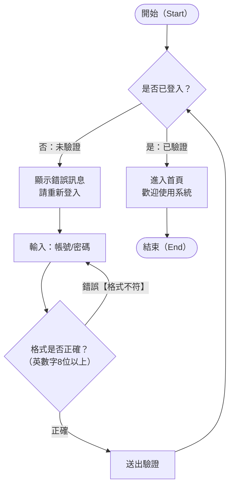

***

## 各類型最佳實踐範本

### Flowchart（流程圖）

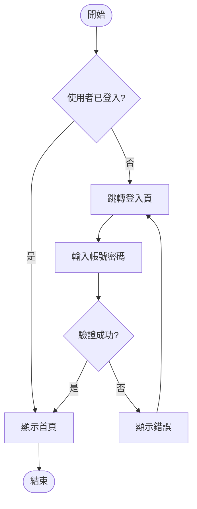

方向選擇：
- TD/TB — 由上而下（適合流程）
- LR — 由左至右（適合管線）
- BT — 由下而上
- RL — 由右至左

節點形狀：
- [矩形] — 一般步驟
- {菱形} — 判斷
- ([圓角]) — 開始/結束
- [(圓柱)] — 資料庫
- [/平行四邊形/] — 輸入/輸出
- [[子流程]] — 子程序

***

### Sequence Diagram（序列圖）

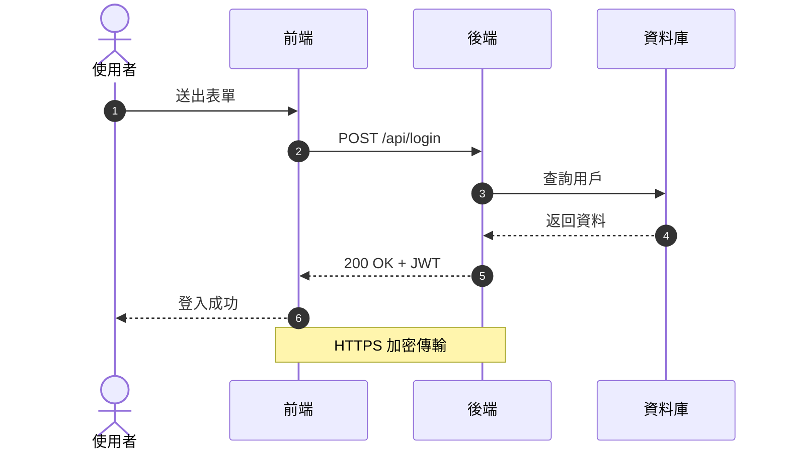

箭頭類型：
- ->> 實線箭頭（請求）
- -->> 虛線箭頭（回應）
- -x 帶X的實線（失敗/非同步）
- --) 開放式箭頭（非同步）

***

### State Diagram（狀態圖）

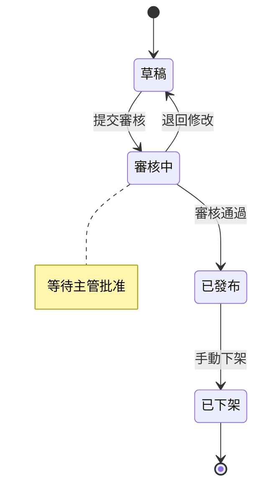

***

### Class Diagram（類別圖）

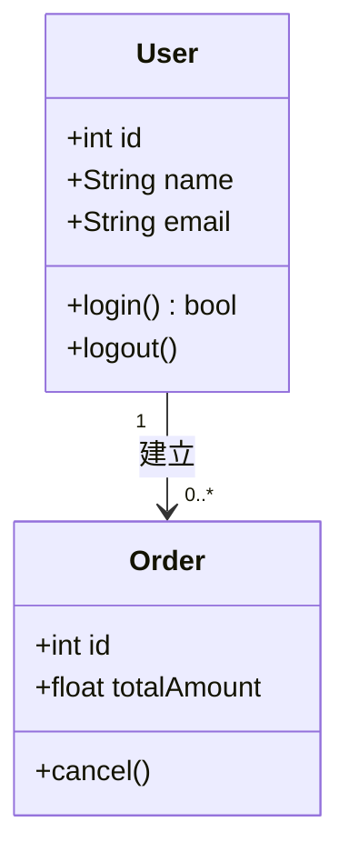

***

### ER Diagram（實體關係圖）

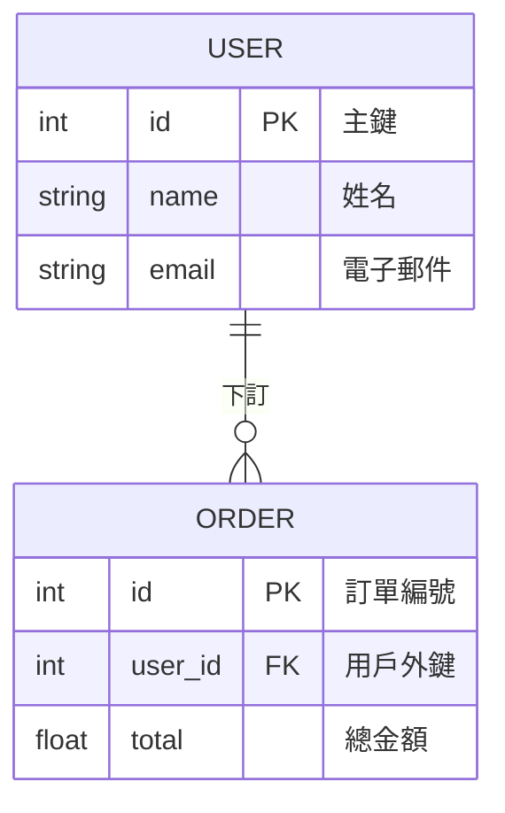

***

### Gantt（甘特圖）

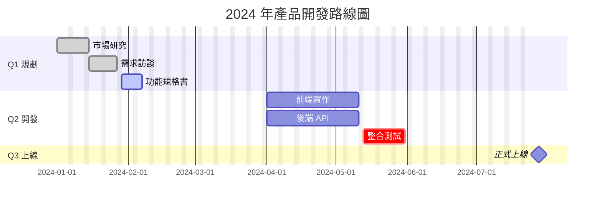

***

### Pie Chart（圓餅圖）

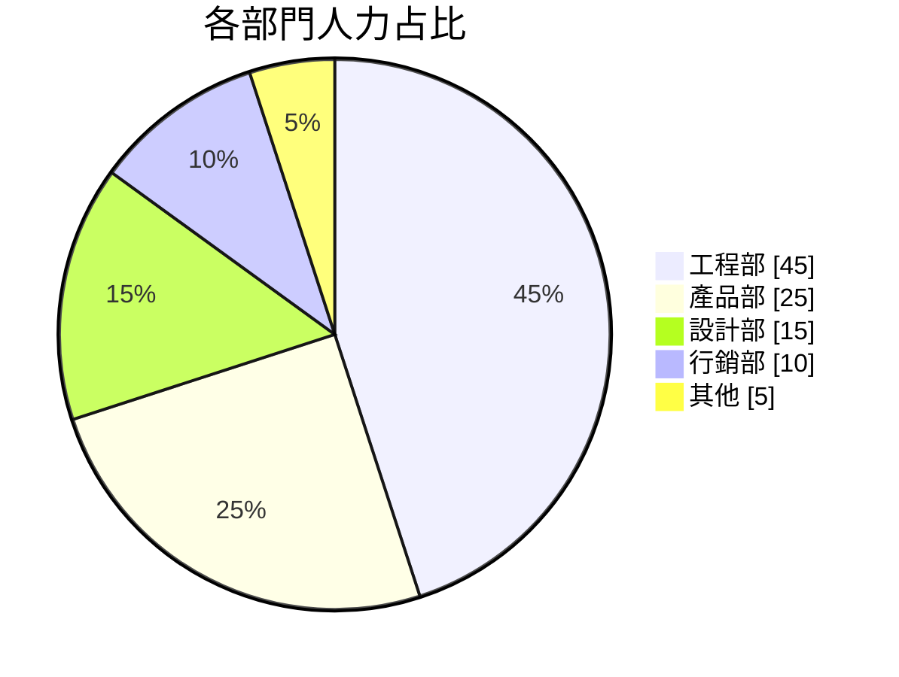

***

### Mindmap（心智圖）

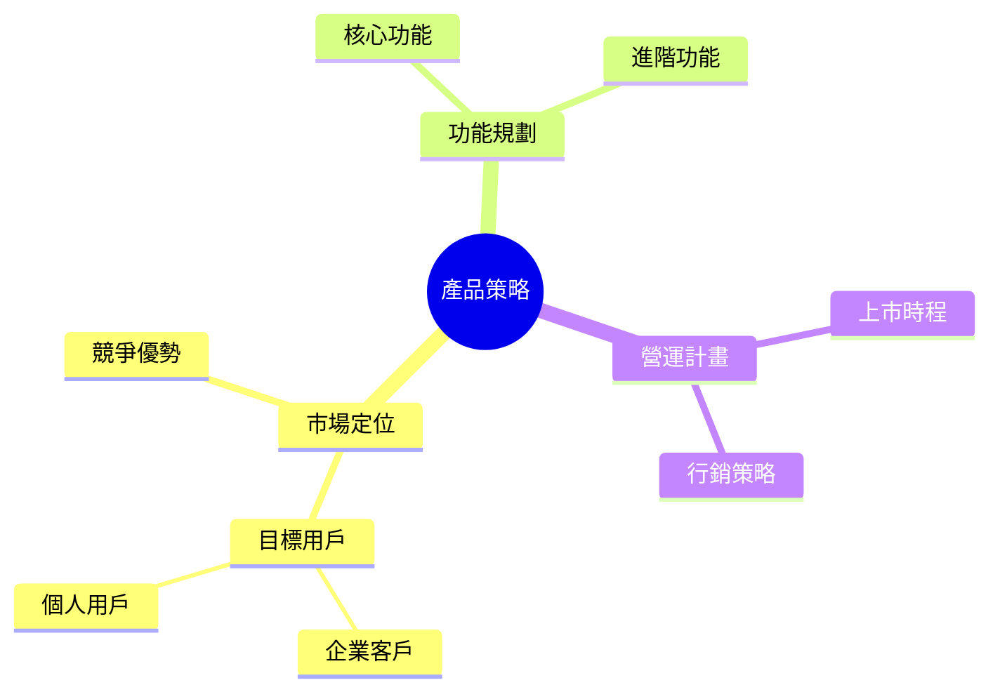

***

### Timeline（時間軸）

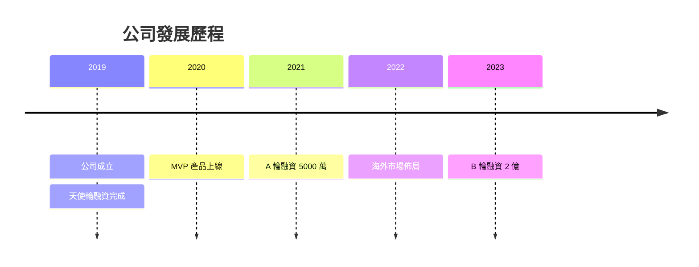

***

### Quadrant Chart（四象限圖）

**最低版本**：v9.4+　**平台相容性**：中（需要 v9.4+，Obsidian 舊版不支援）

#### 完整語法結構

```
quadrantChart
    title <標題>
    x-axis <左端標籤> --> <右端標籤>
    y-axis <下端標籤> --> <上端標籤>
    quadrant-1 <右上象限標籤>   ← 右上
    quadrant-2 <左上象限標籤>   ← 左上
    quadrant-3 <左下象限標籤>   ← 左下
    quadrant-4 <右下象限標籤>   ← 右下

    <點名稱>: [x值, y值]
```

**象限編號對應位置**（常見搞混點）：
```
quadrant-2 (左上) | quadrant-1 (右上)
─────────────────────────────────────
quadrant-3 (左下) | quadrant-4 (右下)
```

#### 座標規則
- x 和 y 值均為 **0.0 ~ 1.0** 之間的小數
- `[0.5, 0.5]` 恰好在中心
- 避免座標剛好在 0.5（軸線上），點會卡在邊界上難以辨識
- 建議分散在 0.1 ~ 0.4 和 0.6 ~ 0.9，不要全部擠在中間

#### 中文兼容規則
- **點名稱（data point）**：含冒號、括號等符號時要加引號
- **軸標籤**：直接寫中文即可，不需引號
- **象限標籤**：直接寫中文即可

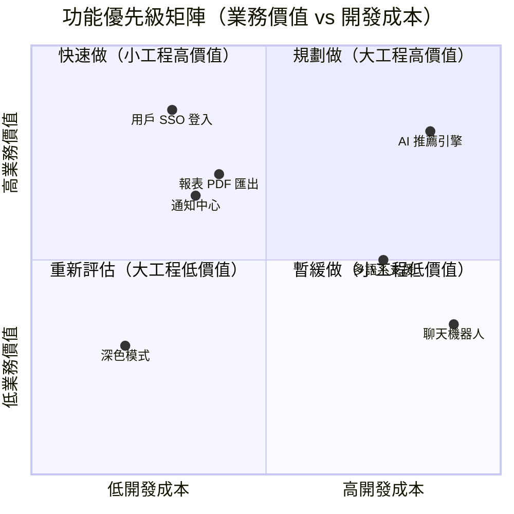

#### 常見陷阱

| 問題 | 原因 | 解法 |
|------|------|------|
| 點名稱含括號/冒號渲染失敗 | 冒號是座標分隔符 | 用雙引號包裹整個名稱 `"名稱(說明): [x,y]"` |
| 象限標籤方向搞錯 | quadrant-1~4 不是直覺的順序 | 記住：1=右上、2=左上、3=左下、4=右下 |
| x-axis / y-axis 箭頭方向錯 | `-->` 代表增加方向 | 左邊寫「低」，右邊寫「高」 |
| 點全部堆在中間 | 座標分布不均 | 刻意將座標分散到 0.1–0.4 與 0.6–0.9 |

***

### Architecture Diagram（系統架構圖）

**最低版本**：v11.0+　**平台相容性**：低（僅新版環境支援，Obsidian / GitLab 多數不支援）

> **優先考慮**：若需要廣泛相容，請改用 `flowchart LR + subgraph`。architecture-beta 適合在 Claude Artifacts、最新版 mermaid-live-editor 等確定 v11+ 的環境使用。

#### 核心概念

| 元素 | 關鍵字 | 說明 |
|------|--------|------|
| 群組（邊框容器） | `group` | 代表一個部署環境、VPC、網段 |
| 服務（節點） | `service` | 代表一個服務、元件、資源 |
| 連線 | `:方向 --> 方向:` | 用方向符號連接兩個 service |

#### 完整語法結構

```
architecture-beta
    group <groupId>(<icon>)[<標籤>]
    group <groupId>(<icon>)[<標籤>] in <parentGroupId>   ← 巢狀群組

    service <serviceId>(<icon>)[<標籤>]
    service <serviceId>(<icon>)[<標籤>] in <groupId>     ← 放入群組

    <serviceId>:<方向> --> <方向>:<serviceId>
```

#### 連線方向符號
- `L` 左、`R` 右、`T` 上、`B` 下
- `A:R --> L:B` 表示從 A 的右側連到 B 的左側

#### 內建 Icon 清單（常用）

| Icon 名稱 | 代表意義 |
|-----------|---------|
| `cloud` | 雲端服務 |
| `server` | 伺服器 |
| `database` | 資料庫 |
| `disk` | 磁碟/儲存 |
| `internet` | 網際網路/用戶端 |
| `user` | 使用者 |
| `gateway` | 閘道 |

完整 icon 清單：https://mermaid.js.org/syntax/architecture

#### 範例：三層式 Web 架構


#### 中文兼容規則
- 群組標籤 `[標籤]` 和服務標籤 `[標籤]` 均支援中文，直接寫即可
- **ID 部分（groupId / serviceId）必須用英文**：`group 用戶組(cloud)[用戶端]` 中，`用戶組` 是 ID，不能用中文
- 正確寫法：`group clientZone(cloud)[用戶端]`，標籤才是中文

#### 常見陷阱

| 問題 | 原因 | 解法 |
|------|------|------|
| 環境不支援、圖表空白 | 需要 v11.0+ | 改用 `flowchart LR + subgraph` |
| service ID 用中文報錯 | ID 必須是英文 | `service dbServer(database)[資料庫]`，標籤才用中文 |
| 連線方向箭頭畫錯 | L/R/T/B 不直覺 | 先畫草圖確認方向，`A:R --> L:B` = 從 A 右側出發接到 B 左側 |
| icon 名稱不存在靜默失敗 | icon 拼錯 | 查官方 icon 清單，常見的就 `server`/`database`/`cloud`/`internet` |

***
### Kanban（看板圖）

**最低版本**：v11.4+　**平台相容性**：極低（目前僅 mermaid-live-editor、Claude Artifacts 等最新環境支援）

> ⚠️ **使用前務必確認環境**：Obsidian、GitHub、GitLab、VS Code 多數尚不支援。若需要廣泛相容，請改用 `flowchart TD` 模擬看板版面。

#### 完整語法結構

```
kanban
    column1[<欄位標題>]
        task1[<任務名稱>]
        task2[<任務名稱>]@{ ticket: "ISSUE-123", priority: "高" }
    column2[<欄位標題>]
        task3[<任務名稱>]
```

#### 任務 metadata（`@{ }` 屬性）

| 屬性 | 說明 | 範例 |
|------|------|------|
| `ticket` | Issue/Ticket 編號 | `ticket: "JIRA-42"` |
| `priority` | 優先級（顯示標籤） | `priority: "Very High"` |
| `assigned` | 負責人 | `assigned: "小明"` |

#### 範例：Sprint 看板

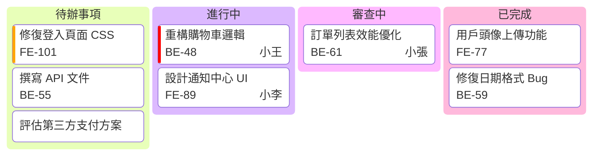

#### 中文兼容規則
- 欄位標題 `[標籤]` 和任務名稱 `[標籤]` 均支援中文
- 含括號、冒號的任務名稱需加雙引號：`task1["修復問題(緊急)"]`
- metadata 屬性值用英文雙引號，**值本身可以是中文**：`assigned: "小明"`
- **task ID（task1 / task2 等）必須用英文或數字**

#### 常見陷阱

| 問題 | 原因 | 解法 |
|------|------|------|
| 整個圖表不顯示 | 環境版本 < v11.4 | 確認環境版本，或改用 `flowchart TD` 模擬 |
| `@{ }` metadata 不顯示 | 環境不支援 / 語法錯誤 | 簡化為無 metadata 版本先測試 |
| 任務名含特殊符號報錯 | 同 flowchart 規則 | 整個名稱加雙引號 |
| ticket 號碼含 `-` 報錯 | 需要加引號 | `ticket: "JIRA-42"`（有引號才安全） |

#### 不支援時的替代方案

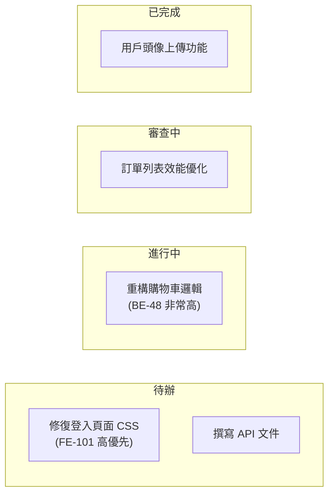

***
## 輸出格式指引

### 在 Markdown 中
使用 mermaid code block（三個反引號 + mermaid）

### 在 Artifact 中（渲染更穩定，推薦）

HTML artifact 範本：
```html
<!DOCTYPE html>
<html lang="zh-TW">
<head>
<meta charset="UTF-8">
<script type="module">
import mermaid from 'https://cdn.jsdelivr.net/npm/mermaid@11/dist/mermaid.esm.min.mjs';
mermaid.initialize({
  startOnLoad: true,
  theme: 'default',
  themeVariables: {
    fontFamily: '"Noto Sans TC", "Microsoft JhengHei", "PingFang TC", sans-serif'
  }
});
</script>
</head>
<body>
<pre class="mermaid">
<!-- 圖表程式碼放這裡 -->
</pre>
</body>
</html>
```

更多 React artifact 範本見 references/react-template.md

***

## 常見錯誤排除

| 錯誤現象 | 原因 | 解法 |
|---------|------|------|
| 節點不顯示 | 中文含括號 | 用雙引號包裹整個標籤 |
| Parse error | 特殊符號衝突 | 將標籤加雙引號 |
| ER 圖欄位報錯 | 欄位名含中文 | 改用英文欄位名，用 comment 加中文 |
| 序列圖亂碼 | 編碼問題 | 確保檔案為 UTF-8 |
| Class 方法錯誤 | 中文方法名 | 改用英文方法名 |
| Gitgraph branch 錯誤 | 中文 branch 名 | 改用英文 branch 名 |
| 中文顯示方塊 | 缺乏字型 | 設定 themeVariables.fontFamily |

***

## 主題設定

```javascript
mermaid.initialize({
  theme: 'default',  // default | dark | forest | base | neutral
  themeVariables: {
    fontFamily: '"Noto Sans TC", "Microsoft JhengHei", sans-serif'
  }
});
```

***

## 從論壇歸納的進階陷阱（新增）

以下議題來自 GitHub Issues、Obsidian Forum、Stack Overflow、DEV Community 等論壇的實際回報，屬於官方文件未明確說明的隱藏地雷。

***

### 議題 1：`AND` / `OR` 在邊標籤中是保留關鍵字

**論壇來源**：技術部落格 CSMAIR、GitHub mermaid-js（多個 issue）

**現象**：即使用引號包裹，在邊標籤（edge label）中使用 `AND` 或 `OR` 仍可能導致 Parse error。

```
# 危險：AND / OR 在邊標籤會觸發 parser 邏輯運算子解析
flowchart LR
    Tester -->|"q=[cond1, AND, cond2]"| API   ← 可能報錯

# 安全：用底線包裹或換用符號
flowchart LR
    Tester -->|"q=[cond1, _AND_, cond2]"| API  ← 安全
    Tester -->|"q=cond1 + cond2"| API          ← 安全（AND 語義用 +）
    Tester -->|"q=cond1 / cond2"| API          ← 安全（OR 語義用 /）
```

**根本原因**：Mermaid 的內部 parser 把 `AND`/`OR` 當作邏輯運算子 token，在某些 rendering context 下就算有引號也無法完全隔離。

**規則**：邊標籤中避免使用純大寫的 `AND`、`OR`；需要時用 `_AND_`、`+`、或中文「且」「或」替代。

***

### 議題 2：角括號 `<...>` 被 HTML renderer 解析為 HTML tag

**論壇來源**：CSMAIR 技術部落格（Dec 2025）、GitHub mermaid-js #5498

**現象**：在 HTML-based 渲染器（VS Code Markdown PDF、Obsidian、GitHub Pages 等）中，角括號內**純英文**的內容會被解析為 HTML tag，導致 Parse error。

```
# 危險：純英文角括號 → 被誤解為 HTML tag
A -.->|"200(rows=<row>)"| T          ← 誤解為 <row> tag，報錯
A -.->|"200(rows=<unchanged>)"| T    ← 誤解為 <unchanged> tag，報錯

# 特別危險：真正的 HTML tag 名稱（即使加了其他字元仍失敗）
A -.->|"200(rows=<meta값유지>)"| T   ← 仍失敗！<meta 被識別為 HTML meta tag

# 安全：加入非英文字元或數字打破 HTML tag 模式
A -.->|"200(rows=<1row>)"| T         ← 安全（有數字）
A -.->|"200(rows=<資料列>)"| T       ← 安全（有中文）
A -.->|"200(rows=<row_數量>)"| T     ← 安全（有底線+中文）
```

**危險 HTML tag 名稱黑名單**（加中文字元仍失敗）：
`<meta>`, `<div>`, `<span>`, `<a>`, `<p>`, `<br>`, `<script>`, `<style>`, `<input>`, `<form>`, `<head>`, `<body>`, `<html>`

**規則**：邊標籤或節點標籤中若含角括號，要麼改用中文字元取代英文，要麼用 `#60;`（`<`）和 `#62;`（`>`）逸出碼。

```
# 最安全：用逸出碼
A -->|"狀態: #60;active#62;"| B
```

***

### 議題 3：`linkStyle` 中 hex 色碼放最後一個屬性會報錯

**論壇來源**：GitHub mermaid-js #5498（May 2024，狀態：Open）

**現象**：`#` 開頭的 hex 色碼如果是 `linkStyle` 屬性的**最後一個**，會被 parser 當作 Mermaid entity code（如 `#35;`）觸發 Parse error。

```
# 危險：hex 色碼在最後一個屬性位置
linkStyle 0 stroke-width:4px,stroke:#FF69B4    ← Parse error！
linkStyle 0 color:red,stroke:#FF69B4           ← Parse error！

# 安全方法 1：確保 hex 色碼不在最後（後面再接其他屬性）
linkStyle 0 stroke:#FF69B4,stroke-width:4px    ← 安全（hex 不在最後）

# 安全方法 2：用 CSS 具名色取代 hex（適合常用色）
linkStyle 0 stroke-width:4px,stroke:HotPink    ← 安全
linkStyle 0 stroke-width:4px,stroke:deepskyblue ← 安全

# 安全方法 3：在 hex 色碼後加分號結尾
linkStyle 0 stroke-width:4px,stroke:#FF69B4;   ← 某些版本可用
```

**根本原因**：Mermaid parser 的 `#` 符號處理邏輯在行尾位置有 bug，會誤當 entity code 處理。此 bug 在 v10.9.0、v11.x 均存在（截至 2025 仍 Open）。

**最佳實踐**：`linkStyle` 時永遠把 hex 色碼排在第一個屬性，或改用 CSS 具名色。

***

### 議題 4：subgraph 的 `direction` 指令在多數情況下無效

**論壇來源**：GitHub mermaid-js #2509, #3096, #4648, #4738, #6427, #6438（均為 Open/持續回報）

**現象**：在 `subgraph` 內設定 `direction` 指令，實際上**不起作用**或行為不一致，這是一個長期存在的已知 bug。

```
# 以下寫法語法正確但 direction 實際上常被忽略：
flowchart TD
    subgraph 群組A
        direction LR     ← 看起來合法，實際上常無效
        A --> B
    end
    subgraph 群組B
        direction TB     ← 同上，常被忽略
        C --> D
    end
```

**已知觸發條件**：
1. 當 subgraph 內的節點有連線指向 subgraph **外部**節點時，子圖 direction 被外層方向覆蓋
2. 當全域方向是 `TD` 且子圖也設 `direction TD`，某些版本直接報 Parse error（#6427）
3. 巢狀 subgraph 超過 2 層後，direction 繼承行為完全不可預期

**規則與替代方案**：
```
# 替代方案 1：不在 subgraph 內用 direction，接受外層方向
flowchart LR
    subgraph 群組A
        A --> B
    end

# 替代方案 2：改用多個獨立圖表表達不同方向

# 替代方案 3：改用 Architecture 圖（v11+，原生支援混合方向）
architecture-beta
    group groupA(cloud)[群組A]
    service a(server)[A] in groupA
    service b(server)[B] in groupA
```

**警告**：不要在文件中記錄「subgraph direction 可以設定子圖方向」，會誤導讀者。此功能的 Issues 從 2021 到 2025 持續未修復。

***

### 議題 5：各平台/工具的 Mermaid 版本差異導致圖表類型不支援

**論壇來源**：Obsidian Forum 多篇（2023–2025）、GitHub Mermaid-Chart/vscode-mermaid-preview #145

**現象**：在某個平台測試成功的圖表，換到另一個平台出現 "No diagram type detected" 錯誤。

**各平台 Mermaid 版本落後情況（2025 年觀察）**：

| 平台/工具 | 已知問題 | 說明 |
|----------|---------|------|
| Obsidian | 常落後 2–3 個大版本 | `timeline`、`block`、`packet`、`kanban`、`architecture` 等新圖表常不支援 |
| VS Code 原生 Markdown Preview | 版本固定於 VS Code 發布時 | 需安裝第三方 extension 才能使用新語法 |
| GitHub | 更新較及時 | 通常支援到 v10+ |
| GitLab | 中等速度更新 | 偶有落後 |
| Notion | 整合版本較舊 | 只支援基本圖表 |
| Claude.ai Artifacts | 透過 CDN 載入，可指定版本 | 指定 `@11` 可用最新功能 |

**各圖表類型最低版本需求**：

| 圖表類型 | 引入版本 | Obsidian 常見狀態 |
|---------|---------|----------------|
| flowchart / sequenceDiagram | v0.x | 穩定支援 |
| classDiagram | v8.x | 穩定支援 |
| stateDiagram-v2 | v8.x | 穩定支援 |
| mindmap | v9.4+ | 部分版本不支援 |
| timeline | v9.4+ | 常不支援 |
| gitgraph | v9.0+ | 大多支援 |
| xychart-beta | v10.3+ | 較少平台支援 |
| block | v11.0+ | 多數平台不支援 |
| architecture-beta | v11.0+ | 多數平台不支援 |
| kanban | v11.4+ | 極少平台支援 |
| packet-beta | v11.0+ | 多數平台不支援 |
| radar | v11.4+ | 極少平台支援 |

**規則**：
- 為**最廣相容性**（Obsidian、GitHub、GitLab 通用）：只用 v9.x 以前穩定的圖表類型
- 確認目標平台版本後再使用新功能
- Claude.ai Artifacts 可直接指定最新版：`https://cdn.jsdelivr.net/npm/mermaid@11/dist/mermaid.esm.min.mjs`

***

### 議題 6：Front Matter（`---`）與 `%%{init:...}%%` 指令的版本與平台相容性

**論壇來源**：Obsidian Forum #51541、GitHub mermaid-js 多個 issues

**兩種設定方式的差異**：

| 特性 | Front Matter（`---`） | `%%{init:...}%%` 指令 |
|-----|-------------------|---------------------|
| 引入版本 | v10.0+ | v8.x+ |
| 語法 | YAML 格式 | JSON-like 格式 |
| 平台相容性 | 較差（v10+ 才支援） | 較佳（v8 起廣泛支援） |
| 功能 | title + config | config only |

**Front Matter 正確語法**（v10+）：
```
***
title: 我的流程圖
config:
  theme: base
  flowchart:
    htmlLabels: false
  themeVariables:
    primaryColor: "#e8f4f8"
***
flowchart TD
    A --> B
```

**`%%{init}%%` 指令正確語法**（v8+ 廣泛相容）：
```
%%{init: {'theme': 'base', 'themeVariables': {'primaryColor': '#e8f4f8'}}}%%
flowchart TD
    A --> B
```

**常見錯誤**：
```
# 錯誤：Front Matter 縮排用 Tab（YAML 不允許 Tab）
***
config:
  theme: base    ← 這裡其實是 Tab 縮排，會報錯，必須用空格
***

# 錯誤：Obsidian 舊版不支援 Front Matter，用了等於圖表整個不渲染
***
title: 測試
***
classDiagram    ← Obsidian 舊版報 Parse error on line 1

# 錯誤：%%{init}%% 使用單引號以外的引號格式
%%{init: {"theme": "base"}}%%   ← 某些平台不接受雙引號，用單引號更穩
%%{init: {'theme': 'base'}}%%   ← 建議格式

# 正確：不確定平台版本時，theme 用 %%{init}%%，不用 Front Matter
%%{init: {'theme': 'forest'}}%%
flowchart LR
    A --> B
```

**規則**：
- 需要**最大相容性**時：用 `%%{init:...}%%`，不用 Front Matter
- 只在 Claude.ai Artifacts 或確定 v10+ 的環境才用 Front Matter
- Front Matter 的 YAML 縮排必須用**空格（2格）**，絕對不能用 Tab

***

### 議題 7：Gantt 圖的 `dateFormat` 與 `axisFormat` 差異、以及任務數量上限

**論壇來源**：GitHub mermaid-js-cli #784、GitHub mermaid-live-editor discussion #1386

**`dateFormat` vs `axisFormat` 的常見混淆**：

| 指令 | 作用 | 預設值 |
|-----|------|--------|
| `dateFormat` | **輸入**格式：你在程式碼裡寫的日期格式 | `YYYY-MM-DD` |
| `axisFormat` | **輸出**格式：X 軸顯示的日期格式 | `YYYY-MM-DD` |

```
# 常見誤解：設了 dateFormat 以為軸上顯示也會改 → 不會！
gantt
    dateFormat DD-MM-YYYY         ← 輸入格式改為 DD-MM-YYYY
    title 甘特圖
    section 階段一
        任務A: 01-01-2025, 30d   ← 輸入要符合 dateFormat

# 要改軸上顯示，需要另外設 axisFormat
gantt
    dateFormat YYYY-MM-DD
    axisFormat %m/%d             ← 顯示格式改為月/日
    title 甘特圖
    section 階段一
        任務A: 2025-01-01, 30d
```

**任務數量靜默失敗問題**：

```
# Bug：gantt 任務超過約 15 個時，可能靜默失敗（不報錯但不渲染）
gantt
    dateFormat YYYY-MM-DD
    section 階段
        任務1: 2024-01-01, 7d
        任務2: after 任務1, 7d
        ... （超過 ~15 個任務）
        任務16: after 任務15, 7d  ← 可能完全不顯示，且無錯誤訊息
```

**解法**：超過 10 個任務時，考慮拆分成多個 gantt 圖，或改用 timeline 圖表。

**`axisFormat` 常用格式碼（基於 moment.js）**：

| 格式碼 | 輸出範例 | 說明 |
|-------|---------|------|
| `%Y-%m-%d` | 2025-01-15 | 完整日期 |
| `%m/%d` | 01/15 | 月/日 |
| `%b %d` | Jan 15 | 英文月縮寫 |
| `%Y-Q%q` | 2025-Q1 | 年-季度（v10+） |
| `%W週` | 03週 | 第幾週 |

***

更多細節見 references/ 目錄：
- **references/use-case-guide.md — 需求導向選圖指南（從情境找對圖表）** ← 優先查閱
- references/advanced-examples.md — 進階圖表範例
- references/react-template.md — React artifact 模板
- references/troubleshooting.md — 詳細排錯指引
