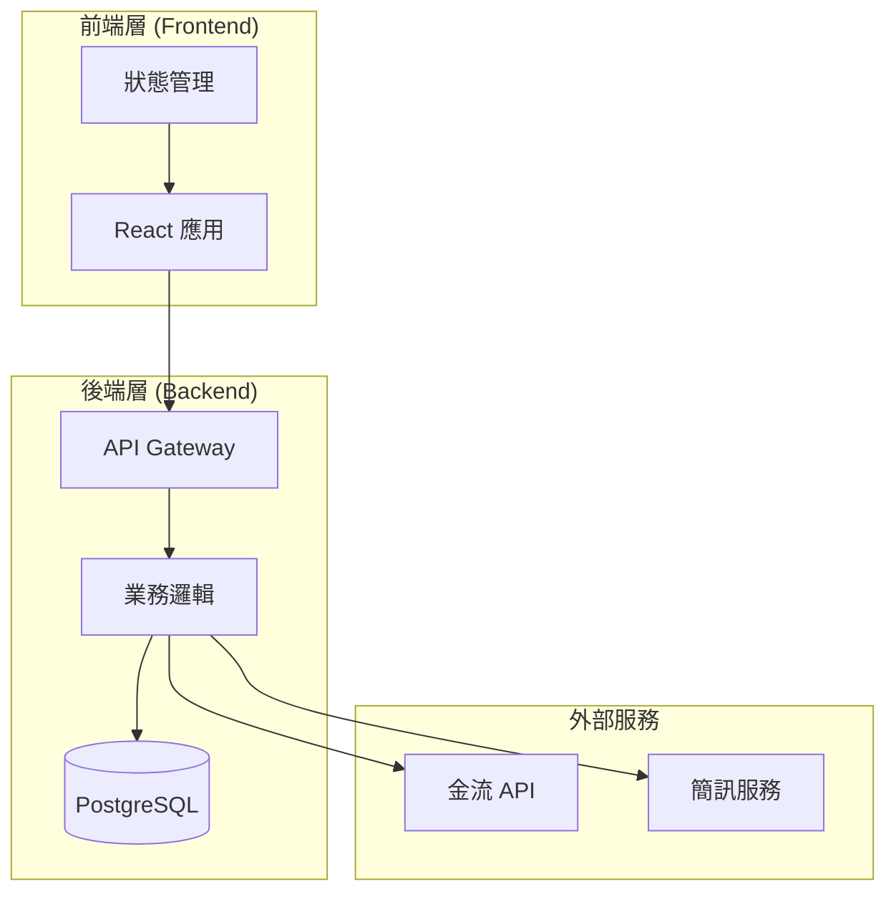
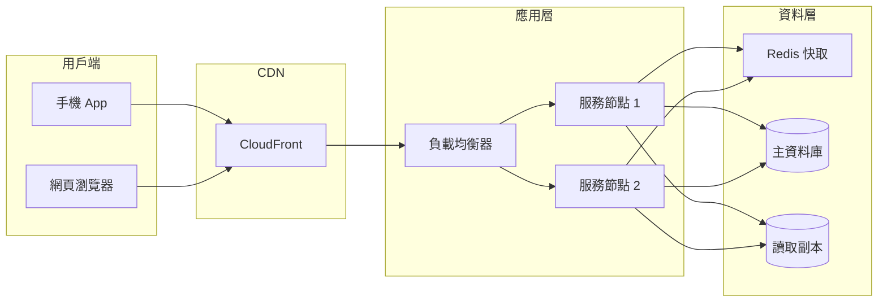
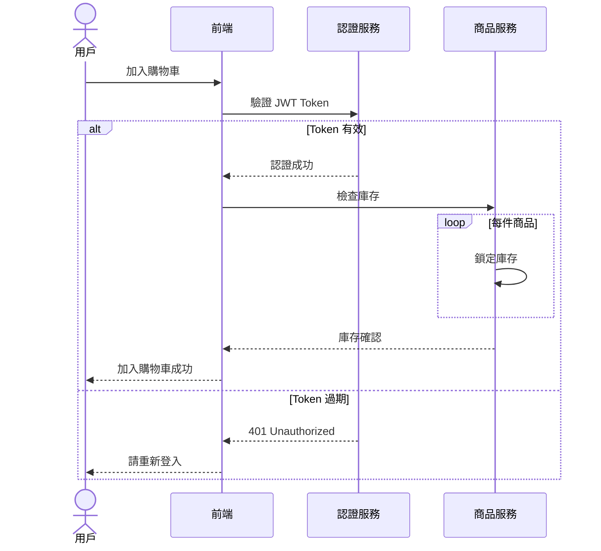
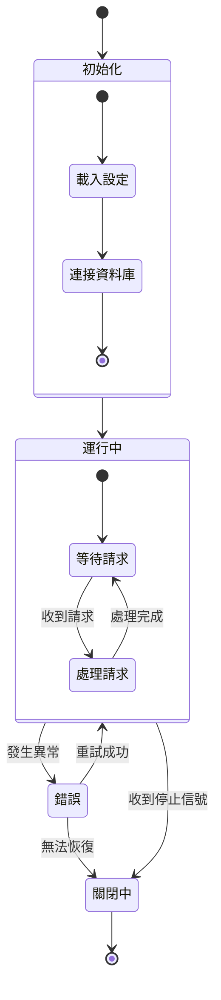
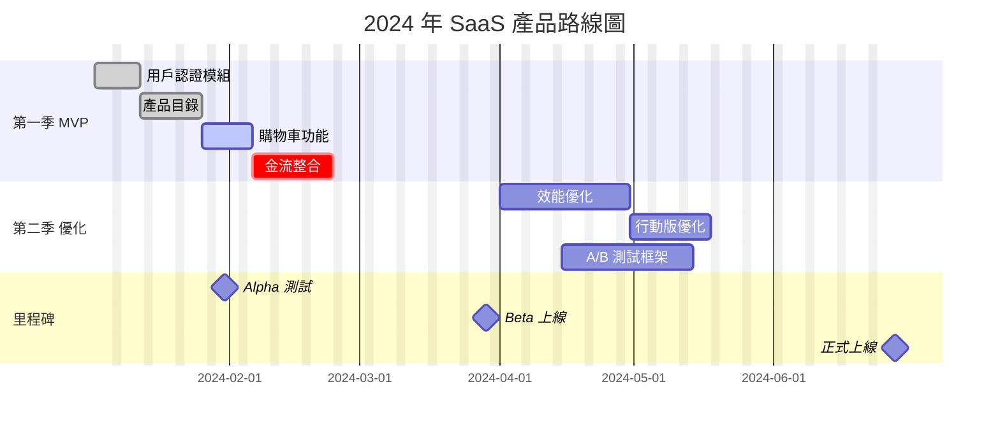

# Mermaid 進階圖表範例

## 子圖（Subgraph）



## 系統架構圖（Architecture）



## 複雜序列圖（含 loop 和 alt）



## 複雜狀態圖（含並行狀態）



## Gitgraph（Git 流程）

```mermaid
gitgraph
    commit id: "初始化專案"
    commit id: "加入基礎架構"

    branch develop
    checkout develop
    commit id: "開發環境設定"

    branch feature/user-auth
    checkout feature/user-auth
    commit id: "新增登入功能"
    commit id: "新增 JWT 驗證"
    commit id: "撰寫單元測試"

    checkout develop
    merge feature/user-auth id: "合併用戶認證"

    branch feature/payment
    checkout feature/payment
    commit id: "整合金流 API"

    checkout develop
    merge feature/payment id: "合併金流功能"

    checkout main
    merge develop id: "v1.0.0 正式發布" tag: "v1.0.0"
```

## 複合型 Gantt



## XY Chart（數據圖）

```mermaid
xychart-beta
    title "月度銷售數據（萬元）"
    x-axis [一月, 二月, 三月, 四月, 五月, 六月]
    y-axis "銷售額" 0 --> 500
    bar [120, 180, 150, 250, 300, 420]
    line [120, 180, 150, 250, 300, 420]
```

## Sankey（桑基圖）

```mermaid
sankey-beta
    用戶來源, 自然搜尋, 1200
    用戶來源, 社群媒體, 800
    用戶來源, 直接流量, 600
    自然搜尋, 購買, 300
    自然搜尋, 離開, 900
    社群媒體, 購買, 200
    社群媒體, 離開, 600
    直接流量, 購買, 250
    直接流量, 離開, 350
```
