# Mermaid 需求導向選圖指南

從「使用者的需求」出發，幫助你找到正確的圖表類型，並給出開箱即用的配置建議。

---

## 快速決策樹

遇到視覺化需求，先問以下三個問題：

```
Q1: 主要想表達什麼？
    ├── 「過程/步驟」                → 跳 A 組（流程類）
    ├── 「誰跟誰的互動/訊息」        → 跳 B 組（互動類）
    ├── 「結構/組成/分類」           → 跳 C 組（結構類）
    ├── 「時間軸/時程/日程」         → 跳 D 組（時間類）
    └── 「數據/比例/分布」           → 跳 E 組（數據類）
```

---

## A 組：流程類需求

### A1. 業務流程、工作流程、SOP

**典型需求描述**：
- 「畫出我們的請假申請流程」
- 「把這份 SOP 文件變成流程圖」
- 「訂單從建立到完成要經過哪些步驟」

**選用**：`flowchart TD`（由上而下）

**判斷方向**：
- 步驟多、有分支、有回頭路 → `TD`（上到下）
- 強調「從輸入到輸出」的管線 → `LR`（左到右）
- 需要放很多節點在有限寬度 → `TD`

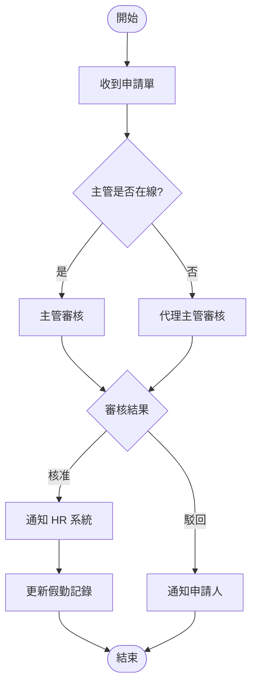
```mermaid
flowchart TD
    A([開始]) --> B[收到申請單]
    B --> C{主管是否在線?}
    C -->|是| D[主管審核]
    C -->|否| E[代理主管審核]
    D --> F{審核結果}
    E --> F
    F -->|核准| G[通知 HR 系統]
    F -->|駁回| H[通知申請人]
    G --> I[更新假勤記錄]
    I --> J([結束])
    H --> J
```

**配置建議**：
- 流程節點用 `[矩形]`
- 判斷用 `{菱形}`
- 開始/結束用 `([圓角矩形])`
- 超過 15 個節點考慮拆成子流程，用 subgraph 分組

---

### A2. 決策樹、問診樹、故障排除

**典型需求描述**：
- 「幫我畫一個判斷使用者分群的決策樹」
- 「IT 支援的故障排除流程」
- 「網站問題排查指南」

**選用**：`flowchart TD`，以菱形為主軸

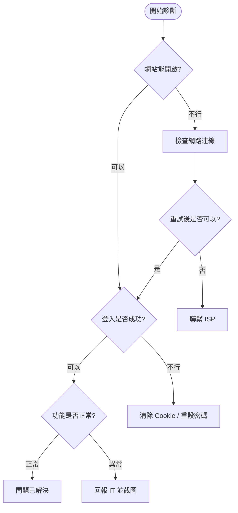
```mermaid
flowchart TD
    Start([開始診斷]) --> Q1{網站能開啟?}
    Q1 -->|可以| Q2{登入是否成功?}
    Q1 -->|不行| D1[檢查網路連線]
    Q2 -->|可以| Q3{功能是否正常?}
    Q2 -->|不行| D2[清除 Cookie / 重設密碼]
    Q3 -->|正常| OK[問題已解決]
    Q3 -->|異常| D3[回報 IT 並截圖]
    D1 --> D1a{重試後是否可以?}
    D1a -->|是| Q2
    D1a -->|否| D1b[聯繫 ISP]
```

**配置建議**：
- 菱形節點盡量保持問句格式（含「？」）
- Yes/No 分支的邊標籤統一用「是/否」或「✓/✗」
- 顏色輔助：classDef 標記「已解決」為綠色、「需處理」為橘色

---

### A3. 程式碼邏輯流程、演算法

**典型需求描述**：
- 「把這段程式碼的邏輯畫成流程圖」
- 「說明這個排序演算法的步驟」
- 「畫出這個 if-else 的結構」

**選用**：`flowchart TD`

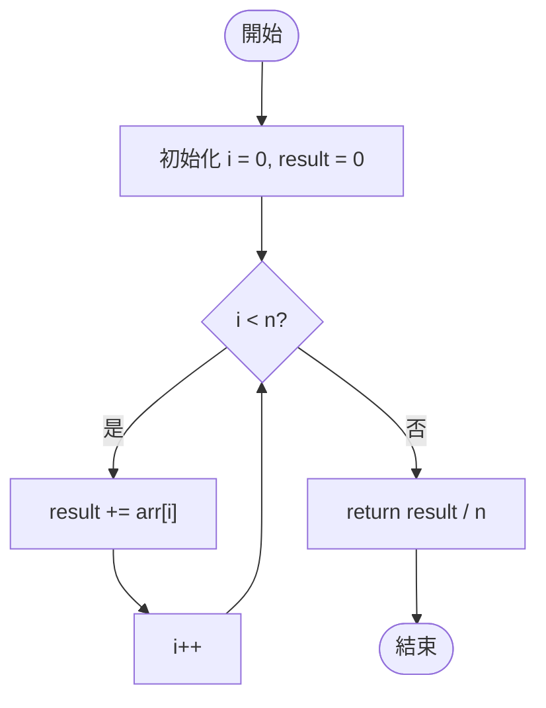
```mermaid
flowchart TD
    Start([開始]) --> Init["初始化 i = 0, result = 0"]
    Init --> Loop{i < n?}
    Loop -->|是| Calc["result += arr[i]"]
    Calc --> Inc["i++"]
    Inc --> Loop
    Loop -->|否| Return["return result / n"]
    Return --> End([結束])
```

**配置建議**：
- 程式碼片段放在引號標籤內，含特殊符號一律加 `""`
- 使用 `[[子程序]]` 形狀表示函式呼叫
- 迴圈的「回頭邊」方向設定 `flowchart LR` 有時視覺更清晰

---

## B 組：互動類需求

### B1. API 互動、前後端溝通、微服務呼叫鏈

**典型需求描述**：
- 「畫出這個 API 的請求/回應流程」
- 「前端呼叫後端，後端再呼叫資料庫，怎麼畫？」
- 「微服務 A 怎麼跟 B、C 溝通」

**選用**：`sequenceDiagram`

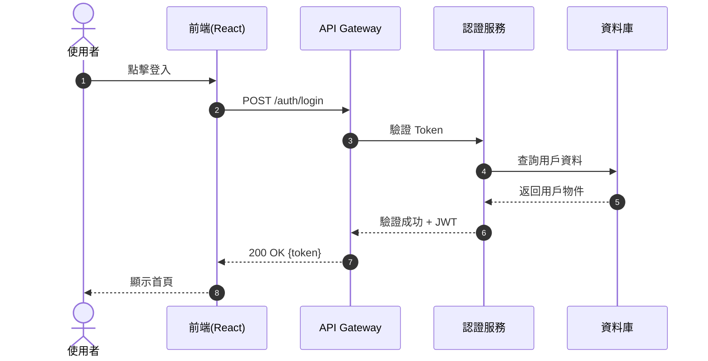
```mermaid
sequenceDiagram
    autonumber
    actor 使用者
    participant 前端 as 前端(React)
    participant API as API Gateway
    participant 認證 as 認證服務
    participant DB as 資料庫

    使用者->>前端: 點擊登入
    前端->>API: POST /auth/login
    API->>認證: 驗證 Token
    認證->>DB: 查詢用戶資料
    DB-->>認證: 返回用戶物件
    認證-->>API: 驗證成功 + JWT
    API-->>前端: 200 OK {token}
    前端-->>使用者: 顯示首頁
```

**配置建議**：
- `autonumber` 讓每步驟有序號，方便討論
- `actor` 用於人類角色，`participant` 用於系統
- 回應用虛線 `-->>`，請求用實線 `->>`
- 重要步驟加 `Note over A,B: 說明文字` 標注

---

### B2. 使用者行為流程、使用者旅程（User Journey）

**典型需求描述**：
- 「畫出使用者從進入網站到完成購買的旅程」
- 「新用戶 onboarding 的體驗流程」

**選用**：`journey`（User Journey 圖）

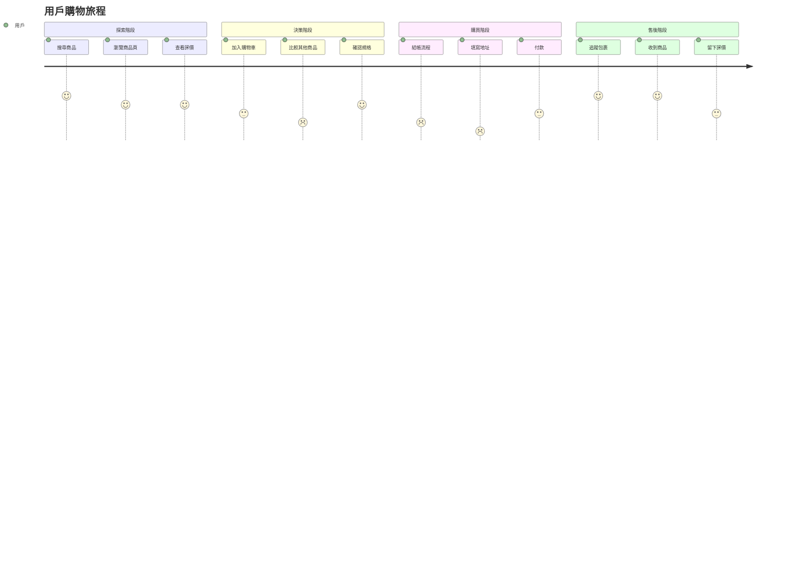
```mermaid
journey
    title 用戶購物旅程
    section 探索階段
        搜尋商品: 5: 用戶
        瀏覽商品頁: 4: 用戶
        查看評價: 4: 用戶
    section 決策階段
        加入購物車: 3: 用戶
        比較其他商品: 2: 用戶
        確認規格: 4: 用戶
    section 購買階段
        結帳流程: 2: 用戶
        填寫地址: 1: 用戶
        付款: 3: 用戶
    section 售後階段
        追蹤包裹: 5: 用戶
        收到商品: 5: 用戶
        留下評價: 3: 用戶
```

**配置建議**：
- 分數 1–5 代表滿意度，1 最低
- `section` 代表旅程的不同階段
- 可標注多個 actor（角色）同時出現在同一步驟

---

### B3. 物件之間的訊息傳遞（協作圖）

**典型需求描述**：
- 「這個設計模式的物件是怎麼互動的」
- 「Event-driven 架構裡，事件如何流動」

**選用**：`sequenceDiagram`（加 `activate/deactivate` 表示生命週期）

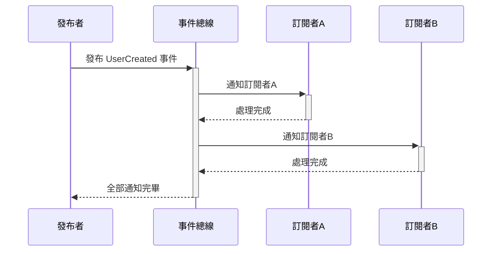
```mermaid
sequenceDiagram
    participant Publisher as 發布者
    participant Bus as 事件總線
    participant Sub1 as 訂閱者A
    participant Sub2 as 訂閱者B

    Publisher->>+Bus: 發布 UserCreated 事件
    Bus->>+Sub1: 通知訂閱者A
    Sub1-->>-Bus: 處理完成
    Bus->>+Sub2: 通知訂閱者B
    Sub2-->>-Bus: 處理完成
    Bus-->>-Publisher: 全部通知完畢
```

---

## C 組：結構類需求

### C1. 物件導向設計、類別關係、資料模型（程式設計師視角）

**典型需求描述**：
- 「畫出這個模組的 class 圖」
- 「繼承關係怎麼畫？」
- 「介面和實作類別的關係」

**選用**：`classDiagram`

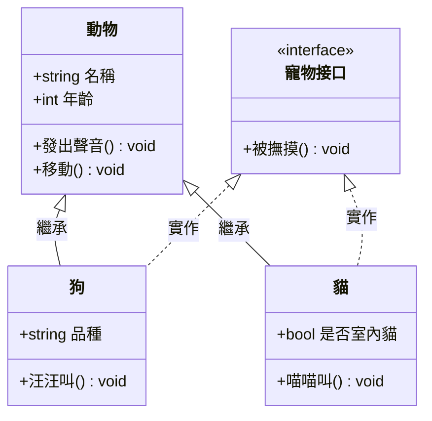
```mermaid
classDiagram
    class 動物 {
        +string 名稱
        +int 年齡
        +發出聲音() void
        +移動() void
    }
    class 狗 {
        +string 品種
        +汪汪叫() void
    }
    class 貓 {
        +bool 是否室內貓
        +喵喵叫() void
    }
    class 寵物接口 {
        <<interface>>
        +被撫摸() void
    }

    動物 <|-- 狗 : 繼承
    動物 <|-- 貓 : 繼承
    寵物接口 <|.. 狗 : 實作
    寵物接口 <|.. 貓 : 實作
```

**配置建議**：
- 類別名稱可用中文，但方法/屬性名建議英文
- 關係語法：`<|--` 繼承、`<|..` 實作、`-->` 關聯、`o--` 聚合、`*--` 組合
- `<<interface>>` 或 `<<abstract>>` 加在類別上方

---

### C2. 資料庫表格設計、資料庫 Schema（資料工程師視角）

**典型需求描述**：
- 「把這個資料庫的 ER 圖畫出來」
- 「訂單、商品、用戶三個表格的關聯」
- 「哪個 table 對應到哪個 table」

**選用**：`erDiagram`

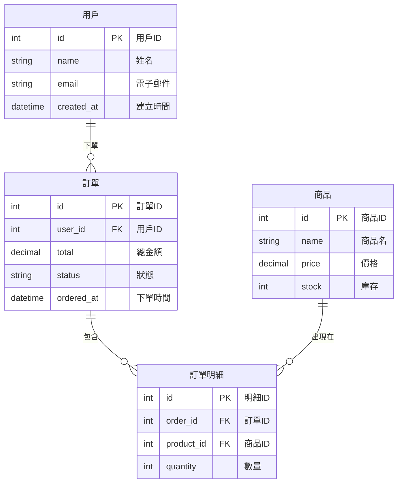
```mermaid
erDiagram
    用戶 {
        int id PK "用戶ID"
        string name "姓名"
        string email "電子郵件"
        datetime created_at "建立時間"
    }
    訂單 {
        int id PK "訂單ID"
        int user_id FK "用戶ID"
        decimal total "總金額"
        string status "狀態"
        datetime ordered_at "下單時間"
    }
    商品 {
        int id PK "商品ID"
        string name "商品名"
        decimal price "價格"
        int stock "庫存"
    }
    訂單明細 {
        int id PK "明細ID"
        int order_id FK "訂單ID"
        int product_id FK "商品ID"
        int quantity "數量"
    }

    用戶 ||--o{ 訂單 : "下單"
    訂單 ||--o{ 訂單明細 : "包含"
    商品 ||--o{ 訂單明細 : "出現在"
```

**配置建議**：
- `PK`、`FK`、`UK` 標注鍵的類型
- 引號裡加中文 comment 說明欄位含義（欄位名本身必須英文）
- 關係符號：`||--||` 一對一、`||--o{` 一對多、`}o--o{` 多對多

---

### C3. 系統架構圖、技術棧關係

**典型需求描述**：
- 「畫出整個後台系統的架構」
- 「前中後台各有哪些服務，怎麼部署」
- 「微服務的拓撲圖」

**選用**：`flowchart LR` + subgraph（最廣相容）或 `architecture-beta`（v11+）

**方案一：flowchart + subgraph（適合所有平台）**

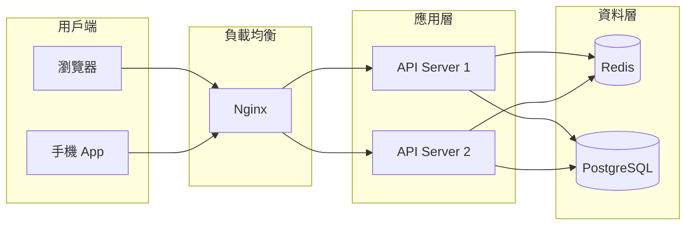
```mermaid
flowchart LR
    subgraph 用戶端
        Browser[瀏覽器]
        App[手機 App]
    end
    subgraph 負載均衡
        LB[Nginx]
    end
    subgraph 應用層
        API1[API Server 1]
        API2[API Server 2]
    end
    subgraph 資料層
        Cache[(Redis)]
        DB[(PostgreSQL)]
    end

    Browser --> LB
    App --> LB
    LB --> API1
    LB --> API2
    API1 --> Cache
    API1 --> DB
    API2 --> Cache
    API2 --> DB
```

**方案二：architecture-beta（v11+，排版更自由）**

```
architecture-beta
    group client(internet)[用戶端]
    group backend(cloud)[後端]
    group data(database)[資料層]

    service browser(internet)[瀏覽器] in client
    service lb(server)[負載均衡] in backend
    service api(server)[API 服務] in backend
    service db(database)[資料庫] in data
    service cache(disk)[快取] in data

    browser:R --> L:lb
    lb:R --> L:api
    api:B --> T:db
    api:B --> T:cache
```

---

### C4. 概念關係、知識地圖、心智圖

**典型需求描述**：
- 「把這個主題的所有子概念列出來」
- 「幫我整理這份報告的架構」
- 「腦力激盪的結果怎麼視覺化」

**選用**：`mindmap`

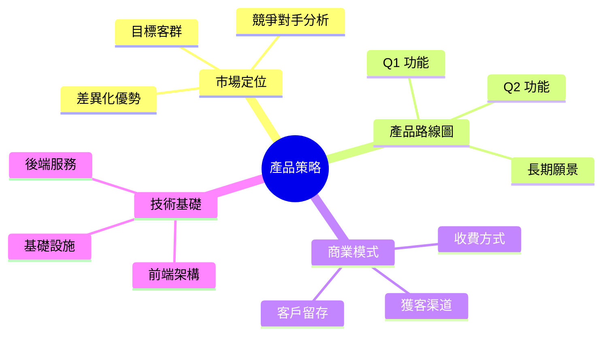
```mermaid
mindmap
    root((產品策略))
        市場定位
            目標客群
            競爭對手分析
            差異化優勢
        產品路線圖
            Q1 功能
            Q2 功能
            長期願景
        商業模式
            收費方式
            獲客渠道
            客戶留存
        技術基礎
            前端架構
            後端服務
            基礎設施
```

**配置建議**：
- 根節點用 `root((雙括號))` 加圓形
- 最多展開 3–4 層，超過會擁擠
- mindmap 不支援節點換行，文字要簡短

---

### C5. 物件/系統的狀態變化

**典型需求描述**：
- 「訂單有哪些狀態，什麼時候會轉換？」
- 「使用者帳號的生命週期」
- 「TCP 連線狀態機」

**選用**：`stateDiagram-v2`

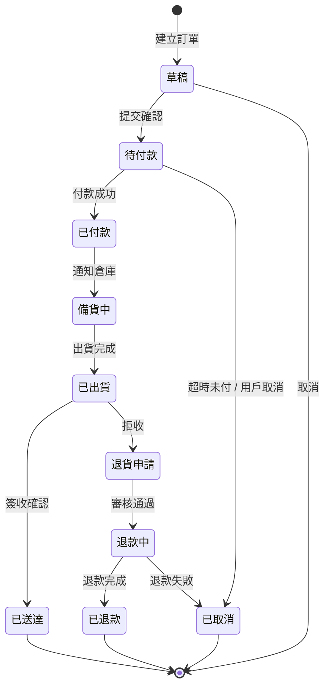
```mermaid
stateDiagram-v2
    [*] --> 草稿 : 建立訂單

    草稿 --> 待付款 : 提交確認
    草稿 --> [*] : 取消

    待付款 --> 已付款 : 付款成功
    待付款 --> 已取消 : 超時未付 / 用戶取消

    已付款 --> 備貨中 : 通知倉庫
    備貨中 --> 已出貨 : 出貨完成
    已出貨 --> 已送達 : 簽收確認
    已出貨 --> 退貨申請 : 拒收

    退貨申請 --> 退款中 : 審核通過
    退款中 --> 已退款 : 退款完成
    退款中 --> 已取消 : 退款失敗

    已送達 --> [*]
    已退款 --> [*]
    已取消 --> [*]
```

**配置建議**：
- 每個狀態代表一個穩定的「存在狀態」，不是動作
- 轉換箭頭上的文字是「觸發事件」或「觸發條件」
- 並行狀態用 `--` 分隔（stateDiagram-v2 支援並發狀態）

### C6. Sprint / 工作項目看板管理

**典型需求描述**：
- 「把我們 Sprint 的任務用看板圖呈現」
- 「畫出工作流程的各個階段和任務」
- 「用視覺化方式追蹤 Issue 狀態」

**選用**：`kanban`（v11.4+）；舊環境改用 `flowchart LR + subgraph`

> ⚠️ **平台限制**：kanban 需要 Mermaid v11.4+，目前 Obsidian、GitHub 多數不支援，使用前確認環境版本。

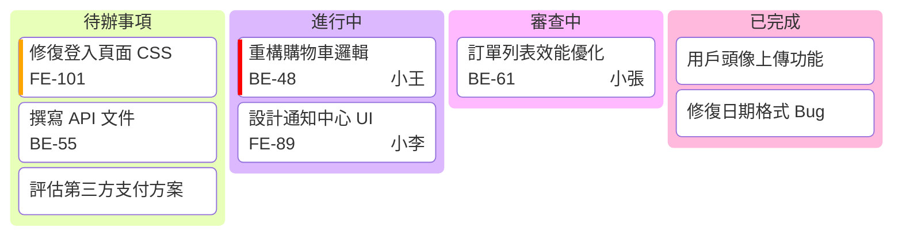
```mermaid
kanban
    todo[待辦事項]
        task1["修復登入頁面 CSS"]@{ ticket: "FE-101", priority: "High" }
        task2[撰寫 API 文件]@{ ticket: "BE-55" }
        task3[評估第三方支付方案]

    inProgress[進行中]
        task4["重構購物車邏輯"]@{ ticket: "BE-48", assigned: "小王", priority: "Very High" }
        task5["設計通知中心 UI"]@{ ticket: "FE-89", assigned: "小李" }

    review[審查中]
        task6[訂單列表效能優化]@{ ticket: "BE-61", assigned: "小張" }

    done[已完成]
        task7[用戶頭像上傳功能]
        task8["修復日期格式 Bug"]
```

**配置建議**：
- `@{ ticket: "...", priority: "...", assigned: "..." }` 附加 metadata（可選）
- priority 可填 `Very High`、`High`、`Low`（英文，顯示時會有顏色標示）
- 任務名稱含括號或冒號時加雙引號
- **v11.4+ 不支援時的替代方案**：改用 `flowchart LR + subgraph`，每個 subgraph 代表一個欄位

---

## D 組：時間類需求

### D1. 專案排程、工作時程規劃

**典型需求描述**：
- 「畫出 Q1 的產品開發時程」
- 「這個專案有哪些里程碑？」
- 「各任務的依賴關係和預計完成日」

**選用**：`gantt`

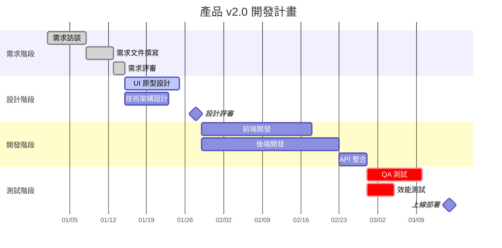
```mermaid
gantt
    title 產品 v2.0 開發計畫
    dateFormat YYYY-MM-DD
    axisFormat %m/%d

    section 需求階段
        需求訪談        :done,    req1, 2025-01-01, 7d
        需求文件撰寫    :done,    req2, after req1, 5d
        需求評審        :done,    req3, after req2, 2d

    section 設計階段
        UI 原型設計     :active,  des1, after req3, 10d
        技術架構設計    :         des2, after req3, 8d
        設計評審        :milestone, 2025-01-28, 0d

    section 開發階段
        前端開發        :         dev1, 2025-01-29, 20d
        後端開發        :         dev2, 2025-01-29, 25d
        API 整合        :         dev3, after dev2, 5d

    section 測試階段
        QA 測試         :crit,    qa1, after dev3, 10d
        效能測試        :crit,    qa2, after dev3, 5d
        上線部署        :milestone, 2025-03-15, 0d
```

**配置建議**：
- `dateFormat` 設定輸入格式（程式碼裡怎麼寫日期）
- `axisFormat` 設定 X 軸顯示格式（獨立設定）
- `milestone` + 日期 + `0d` 標記里程碑
- `crit` 標記關鍵路徑任務
- `after taskId` 設定任務依賴
- **任務建議不超過 15 個**，超過可能靜默失敗

---

### D2. 歷史時間線、事件年表

**典型需求描述**：
- 「把公司的發展歷程畫成時間軸」
- 「技術版本的演進史」
- 「這個月發生了哪些重要事件」

**選用**：`timeline`

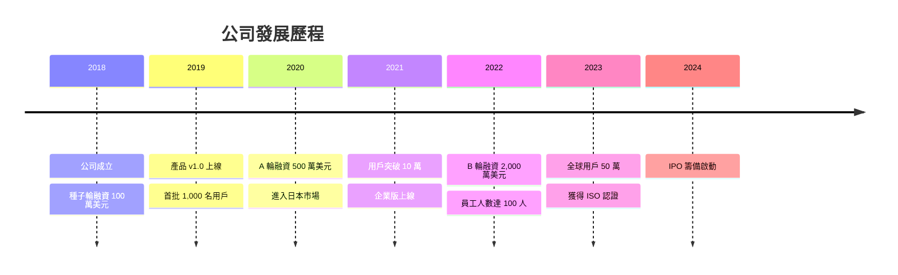
```mermaid
timeline
    title 公司發展歷程

    2018 : 公司成立
         : 種子輪融資 100 萬美元

    2019 : 產品 v1.0 上線
         : 首批 1,000 名用戶

    2020 : A 輪融資 500 萬美元
         : 進入日本市場

    2021 : 用戶突破 10 萬
         : 企業版上線

    2022 : B 輪融資 2,000 萬美元
         : 員工人數達 100 人

    2023 : 全球用戶 50 萬
         : 獲得 ISO 認證

    2024 : IPO 籌備啟動
```

**配置建議**：
- 同一年可以列多個事件（每行一個 `: 事件`）
- 不支援節點內換行，每個事件要精簡
- 事件數量多時，可按「季度」分組而非「年」

---

### D3. Git 分支策略、版本管理歷程

**典型需求描述**：
- 「Git flow 的分支策略怎麼畫？」
- 「這個 repo 的 merge 歷史」
- 「我們的版本發布流程」

**選用**：`gitgraph`

```mermaid
gitgraph LR
    commit id: "初始提交"
    branch develop
    checkout develop
    commit id: "新增登入功能"
    commit id: "修復驗證 bug"

    branch feature/payment
    checkout feature/payment
    commit id: "整合金流 API"
    commit id: "加入付款頁面"

    checkout develop
    merge feature/payment id: "合併金流功能"

    branch release/v1.0
    checkout release/v1.0
    commit id: "版本號更新"

    checkout main
    merge release/v1.0 id: "發布 v1.0" tag: "v1.0.0"

    checkout develop
    commit id: "開始 v1.1 開發"
```

**配置建議**：
- `LR` 方向比 `TB` 更符合 Git 的視覺習慣
- branch 名稱用英文（中文 branch 名有問題）
- `commit id` 加說明文字，commit message 可用中文
- `tag` 標記版本號

---

## E 組：數據類需求

### E1. 佔比、分配、比例

**典型需求描述**：
- 「各部門預算的佔比是多少？」
- 「用戶來自哪些渠道，各佔幾成？」
- 「這次調查的選項分布」

**選用**：`pie`

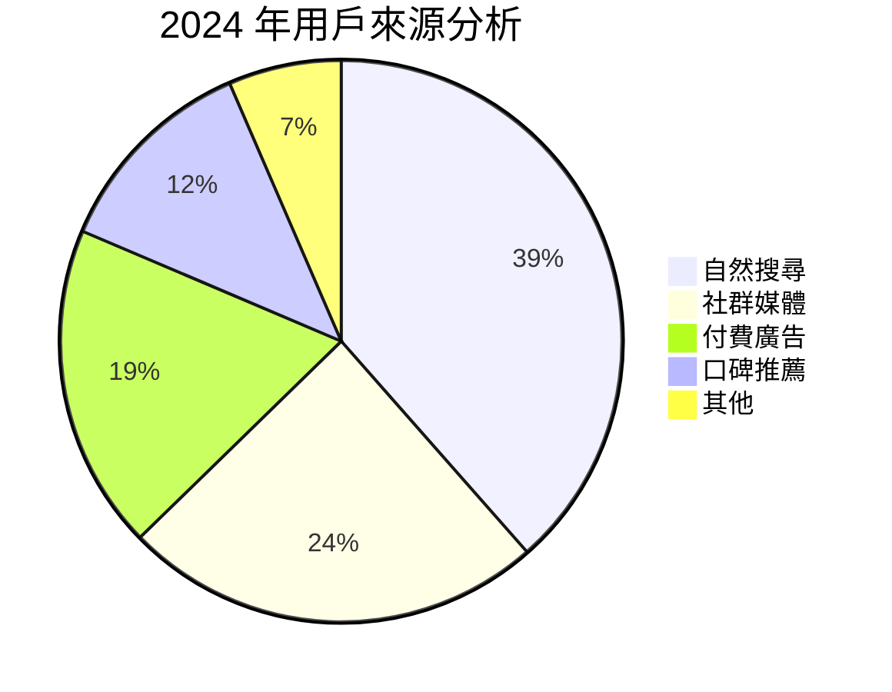
```mermaid
pie title 2024 年用戶來源分析
    "自然搜尋" : 38.5
    "社群媒體" : 24.2
    "付費廣告" : 18.7
    "口碑推薦" : 12.1
    "其他" : 6.5
```

**配置建議**：
- `title` 寫在 `pie` 後同一行
- 標籤需加雙引號
- 數字代表相對比例（不需要加總為 100）
- **限制**：pie 圖不支援互動、不支援多組資料；多組比較請改用 XY Chart

---

### E2. 功能/產品/想法的優先順序排列

**典型需求描述**：
- 「這些功能按「業務影響 vs 開發成本」來排優先級」
- 「把競爭對手放在矩陣上比較」
- 「用波士頓矩陣分析我們的產品線」

**選用**：`quadrantChart`

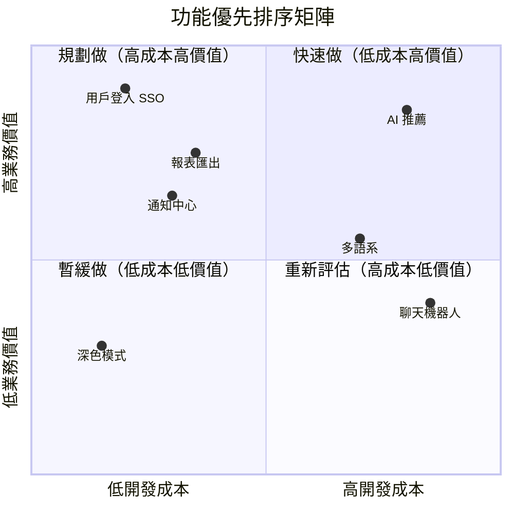
```mermaid
quadrantChart
    title 功能優先排序矩陣
    x-axis 低開發成本 --> 高開發成本
    y-axis 低業務價值 --> 高業務價值
    quadrant-1 快速做（低成本高價值）
    quadrant-2 規劃做（高成本高價值）
    quadrant-3 暫緩做（低成本低價值）
    quadrant-4 重新評估（高成本低價值）

    用戶登入 SSO: [0.2, 0.9]
    深色模式: [0.15, 0.3]
    AI 推薦: [0.8, 0.85]
    報表匯出: [0.35, 0.75]
    多語系: [0.7, 0.55]
    聊天機器人: [0.85, 0.4]
    通知中心: [0.3, 0.65]
```

**配置建議**：
- 座標值 `[x, y]` 均為 0–1 之間的小數
- `x-axis` 和 `y-axis` 的文字描述方向，箭頭代表「增加方向」
- 4 個象限標籤代表策略意義，幫助溝通決策

---

### E3. 趨勢折線圖、長條圖（需要數字視覺化）

**典型需求描述**：
- 「畫出各月份的用戶增長折線圖」
- 「幾個產品線的銷售額比較長條圖」

**選用**：`xychart-beta`

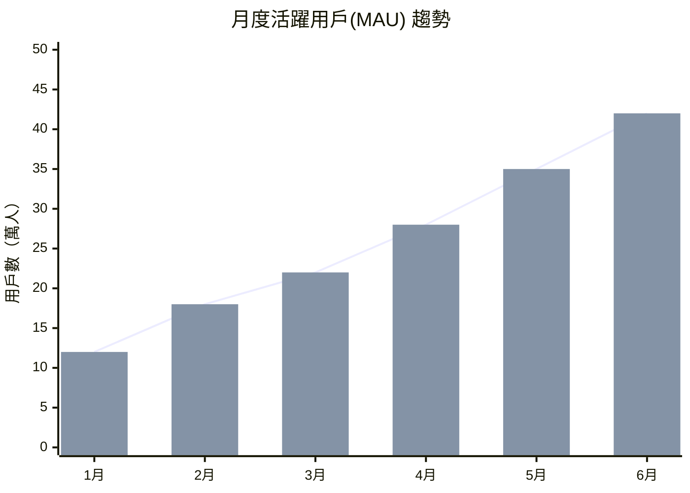
```mermaid
xychart-beta
    title "月度活躍用戶(MAU) 趨勢"
    x-axis ["1月", "2月", "3月", "4月", "5月", "6月"]
    y-axis "用戶數（萬人）" 0 --> 50
    line [12, 18, 22, 28, 35, 42]
    bar  [12, 18, 22, 28, 35, 42]
```

**配置建議**：
- `line` 畫折線，`bar` 畫長條，可同時使用
- `x-axis` 用陣列指定類別標籤
- `y-axis` 設定標題和數值範圍（`最小值 --> 最大值`）
- **注意**：`xychart-beta` 需要 v10.3+，Obsidian 等舊環境可能不支援

---

## 跨組：特殊需求對應

### 需求：想同時展示多個維度的比較

**典型需求描述**：
- 「用雷達圖比較幾個候選方案」
- 「員工能力評估的蛛網圖」

**選用**：`radar`（v11.4+，相容性差）或改用 `quadrantChart` 降維

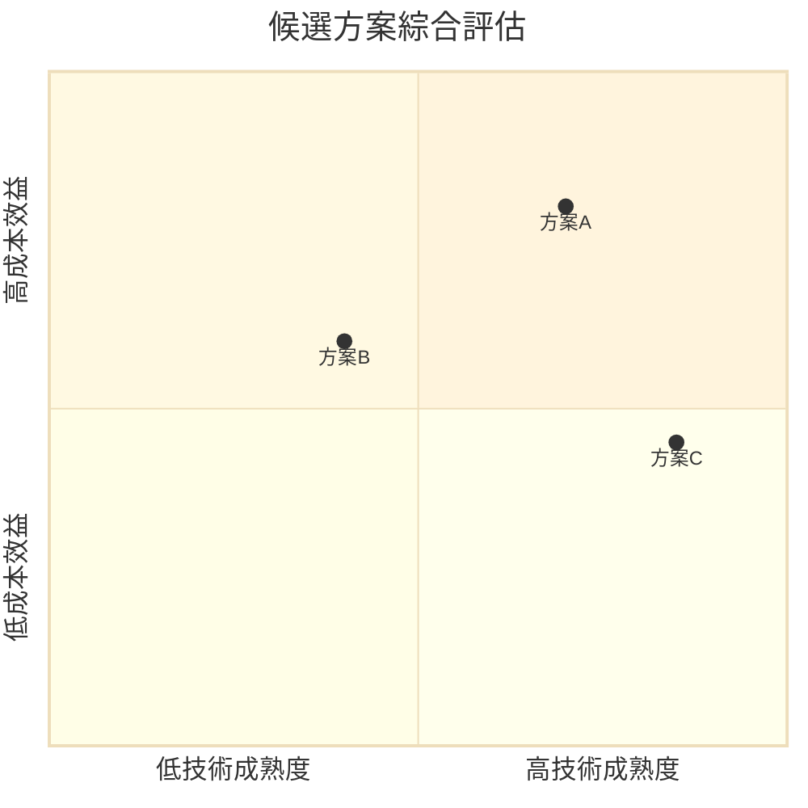
```mermaid
%%{init: {'theme': 'base'}}%%
quadrantChart
    title 候選方案綜合評估
    x-axis 低技術成熟度 --> 高技術成熟度
    y-axis 低成本效益 --> 高成本效益
    方案A: [0.7, 0.8]
    方案B: [0.4, 0.6]
    方案C: [0.85, 0.45]
```

---

### 需求：想展示流量/數量在不同節點之間的分配

**典型需求描述**：
- 「用戶從哪些頁面跳轉到哪些頁面？」
- 「預算在各部門之間的流向」

**選用**：`sankey-beta`（v10.3+）

```
sankey-beta

用戶來源, 首頁, 5000
用戶來源, 商品頁, 3000
首頁, 商品頁, 2000
首頁, 離開, 3000
商品頁, 加入購物車, 2500
商品頁, 離開, 2500
加入購物車, 完成結帳, 1800
加入購物車, 放棄, 700
```

---

### 需求：想說明系統或介面的層次結構（可視化 HTML/XML 結構）

**典型需求描述**：
- 「這個 JSON 物件的層次結構」
- 「網站的頁面層次」
- 「組織的部門樹狀圖」

**選用**：`mindmap`（樹狀最適合）或 `flowchart TD`（有連線語義）

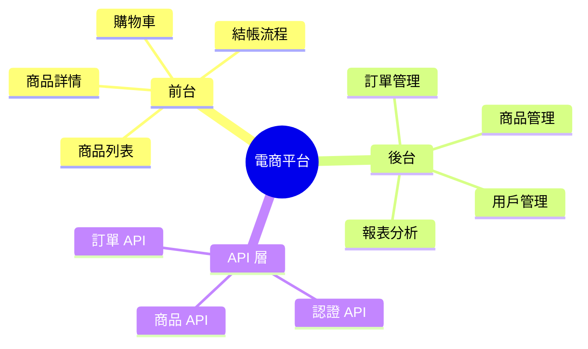
```mermaid
mindmap
    root((電商平台))
        前台
            商品列表
            商品詳情
            購物車
            結帳流程
        後台
            商品管理
            訂單管理
            用戶管理
            報表分析
        API 層
            認證 API
            商品 API
            訂單 API
```

---

## 選圖決策速查表

| 我想呈現... | 推薦圖表 | 備選 | 平台相容性 |
|-----------|---------|------|----------|
| 業務/工作流程 | `flowchart TD` | - | ★★★★★ |
| 程式碼邏輯 | `flowchart TD` | - | ★★★★★ |
| API 互動/訊息 | `sequenceDiagram` | - | ★★★★★ |
| 使用者旅程 | `journey` | `sequenceDiagram` | ★★★★☆ |
| 類別設計(OOP) | `classDiagram` | - | ★★★★★ |
| 資料庫 Schema | `erDiagram` | - | ★★★★★ |
| 系統架構 | `flowchart LR`+subgraph | `architecture-beta` | ★★★★☆ |
| 概念地圖/心智圖 | `mindmap` | - | ★★★★☆ |
| 狀態機 | `stateDiagram-v2` | - | ★★★★★ |
| 專案時程 | `gantt` | - | ★★★★★ |
| 歷史時間線 | `timeline` | - | ★★★★☆ |
| Git 分支歷史 | `gitgraph` | - | ★★★★☆ |
| 佔比/比例 | `pie` | - | ★★★★★ |
| 優先排序矩陣 | `quadrantChart` | - | ★★★★☆ |
| 看板/Sprint 追蹤 | `kanban` | `flowchart LR`+subgraph | ★☆☆☆☆ |
| 系統架構（自由排版） | `architecture-beta` | `flowchart LR`+subgraph | ★★☆☆☆ |
| 趨勢/比較數據 | `xychart-beta` | - | ★★★☆☆ |
| 流量流向/分配 | `sankey-beta` | - | ★★★☆☆ |
| 樹狀/層次結構 | `mindmap` | `flowchart TD` | ★★★★☆ |

★ 數量代表平台相容性：★★★★★ = 幾乎所有平台、★★★☆☆ = 需要 v10+ 環境
